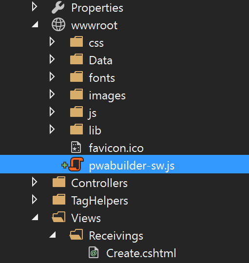
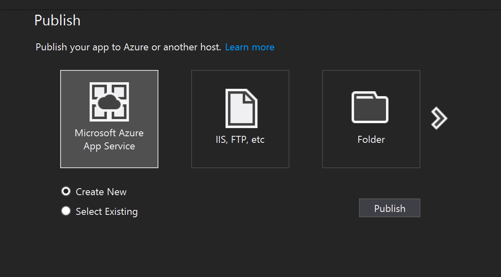

# Task 1.1.3 - Update your Web App with PWA features

## Prerequisites 

This task has a dependency on [Task 1.1.2](112_GeneratePWA.md) and all of it's prerequisites.

## Task 

###  Add Web App Manifest to your site

The first thing you will need to do is pull the "manifest.json" file and the "images" folder that you obtained from the zip file in the previous step.

1. Add the manifest.json and the "images" folder to the root path of your site (wwwroot).  Remember, if you change the path of your "images" folder, you need to update the json in your manifest file to reflect your changes. The easiest way to add new content to a project is to drag and drop the contents from the file explorer into the solutions explorer of your project.

    <!-- ![add image of manifest and paths ] -->

2. Reference the manifest in your page with a link tag:

	    <link rel="manifest" href="manifest.json"></link>

    This can be done by opening the `Views\Shippings\Index.cshtml` page in your site, and adding the following to the top of the document:

        @section HeadExtension{ 
        <link rel="manifest" href="manifest.json" />
        }

### Add Service Worker code to your site

Your Service Worker needs to be added to your site to begin working.  

1. Copy the "pwabuilder-sw.js" file from the zip you downloaded on the Service Worker page of the PWA Builder website and add it to your js folder in wwwroot  (not in a folder) like so:

    


2. Open up the landing page of your app (index.cshtml) and create a new script tag in the head from within the same HeadExtension section like so:

        @section HeadExtension{ 
        <link rel="manifest" href="manifest.json" />
        <script></script>
        }

    You will want to place this at the top of your document.

3. Add the following registration code inside the new script tag:

        //This is the service worker with the combined offline experience (Offline page + Offline copy of pages)
        if(navigator.serviceWorker) {
          //Add this below content to your HTML page, or add the js file to your page at the very top to register service worker
          if (navigator.serviceWorker.controller) {
            console.log('[PWA Builder] active service worker found, no need to register')
          } else {

            //Register the ServiceWorker
            navigator.serviceWorker.register('pwabuilder-sw.js', {
              scope: './'
            }).then(function(reg) {
              console.log('Service worker has been registered for scope:'+ reg.scope);
            });
          }
	      }

<!-- 
### Prime your Service Worker for offline

This Particular Service Worker makes a copy of all the pages you visit and caches it so that you can view any of those pages when the app is offline, or network connectivity is low.  In order to make sure you service worker has a copy of your site, simply visit the pages you want 


1. create a new file inside your root called "pwab-config.json".

2. Copy and past the following JSON object into the new file

```
{}
```
-->
<!-- 3. So we make sure this file is checked for the latest content, set a file life of XXXXXXXXXXXXXX. -->

### Re-Publish Changes

Now that you have these powerful new features running locally, you can publish them to your website to be consumed as a PWA.

1. In Visual studio choose Project > Publish...

2. Choose "Microsoft Azure App Service" from the selection screen.

    > **NOTE** if your Visual Studio project is still debugging your Azure server or your local server, you may need to halt the server before re-publishing.

    

3.  Choose "Publish"


## References
- [PWA Builder](https://www.pwabuilder.com)


## Continue to [next task >> ](114_Test_App.md)
