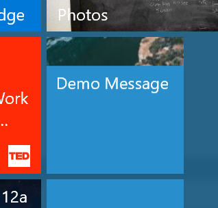

# Task 1.2.1 - Add Windows 10 feature

## Prerequisites 

This task has a dependency on [Task 1.1.4](114_Test_App.md) and all of it's prerequisites.

## Task 

### Add a Windows feature to your web content.

 One of the coolest things about PWAs on Windows 10 is the technical advantages you get over just running in the browser:

- Standalone Window
- Independent from browser process (Less overhead / Isolated cache)
- Nearly unlimited storage (indexed DB, localStorage, etc.)
- Offline & background processes
- Access to Windows Runtime (WinRT) APIs via JavaScript (Calendar / Cortana / Address Book / etc)

### Feature detect for Windows Store APIs

In order to utilize a Windows UWP API, you will want to implement a pattern called "feature detection".  This allows you to write JavaScript on your page that will only be executed in the context where the APIs are available.  In this case, it will only execute while inside a Windows PWA.
  
Feature detection can be as simple as looking for the Windows object as below:

```
if(window.Windows){
/*execute code that calls WIndows APIs */
}

```

Keep in mind that not all Windows APIs are available on all Windows 10 devices.  Think about the fact that a Windows Phone has a "dialer" for making phone calls, so it has unique APIs that are not available on other device types.  Another example is the "Surface Dial" that can be paired to many Windows devices, but not the Xbox, so the "radial dial" APIs are not present on the Xbox.  For more specific feature detection, you will want to feature detect the API family as well like below:

```

if(window.Windows && Windows.UI.Core.SystemNavigationManager){
/*execute code that calls WIndows APIs */
}

```

### Add code to customize your PWA App container

Start out by adding some code that adds a message to the tile in the start menu.  This code can be run from any page, but you will likely want to place it on index.cshtml, so that it runs as soon as the app is opened. 

1. Open `Shipping\index.cshtml` in Visual Studio and add a script tag at the bottom of the page.

2. Add the following feature detection inside the script tag:

        if(window.Windows && Windows.UI.Notifications){
        /*execute code that calls WIndows APIs */
        }

3. Inside the feature detection, add the following code to load the live tile:

        var tileContent = new Windows.Data.Xml.Dom.XmlDocument();
        
        var tile = tileContent.createElement("tile");
        tileContent.appendChild(tile);
        
        var visual = tileContent.createElement("visual");
        tile.appendChild(visual);
        
        var bindingMedium = tileContent.createElement("binding");
        bindingMedium.setAttribute("template", "TileMedium");
        visual.appendChild(bindingMedium);
        
        var peekImage = tileContent.createElement("image");
        peekImage.setAttribute("placement", "peek");
        peekImage.setAttribute("src", "https://unsplash.it/150/150/?random");
        peekImage.setAttribute("alt", "Welcome to Knowsie!");
        bindingMedium.appendChild(peekImage);
        
        var text = tileContent.createElement("text");
        text.setAttribute("hint-wrap", "true");
        text.innerText = "Demo Message";
        bindingMedium.appendChild(text);
        
        //fire the notification
        
        var notifications = Windows.UI.Notifications;
        var tileNotification = new notifications.TileNotification(tileContent);
        notifications.TileUpdateManager.createTileUpdaterForApplication().update(tileNotification);

### Test your changes

To test the changes you have just made, follow the instructions in section 1.1.3 for deploying your web app, then re-deploy your changes.  One of the great things about a PWA is that you don't need to redeploy your app to see the changes, you just need to deploy to the web server.  You should be able to run your app again and see your live tile code take effect (pin your app's tile to the start menu to see).  If you don't see it immediately, it may be because of the great caching you have in your app. If this happens, you can force a cache clear by uninstalling your PWA, then installing it again from the script you downloaded from PWABuilder.com.



**NOTE** if your Visual Studio session is still debugging your Azure instance, you may need to halt your debugger before you test locally again.

## Continue to [next task >> ](122_BONUS-RenoFeatures.md)


