# Task 2.1.1 - Add Desktop Bridge support using Visual Studio 2017

This task will guide you through the process of converting an existing Win32 desktop app to a Desktop Bridge UWP app using Visual Studio 2017.
There are a lot of steps to correctly set up Visual Studio 2017 to build and package your Win32 app as a UWP app. Each update of Visual Studio 2017 had made this process easier.
Future updates to Visual Studio 2017 will most likely add Desktop Bridge project templates that will automate this process. Until then, please follow these steps carefully.

## Prerequisites

* Basic knowledge of C# development

* Basic knowledge of client development with the .NET framework

* Basic knowledge of Windows 10 and the Universal Windows Platform

* A computer with Windows 10 Anniversary Update or Windows 10 Creators Update. If you want to use the Desktop App Converter with an installer, your PC must be running Windows 10 Pro or Windows 10 Enterprise (Windows 10 Home doesn't include the required Containers feature).

* Visual Studio 2017 with the tools to develop applications for the Universal Windows Platform. Any edition of Visual Studio 2017 is supported, including the free [Visual Studio 2017 Community](https://www.visualstudio.com/vs/community/)

* Go to the Git repo at [https://github.com/Knowzy/KnowzyInternalApps](https://github.com/Knowzy/KnowzyInternalApps) and clone or download the content onto your local computer.

## Task: Add Desktop Bridge support in Visual Studio

This task covers the following steps: 

1. Open the existing Knowzy Win32 solution with Visual Studio 2017

2. Add a UWP project and add a project dependency to the existing WPF project

3. Add the Microsoft.Knowzy.WPF binaries to the UWP project

4. Edit the Microsoft.Knowzy.UWP package manifest to enable the Desktop Bridge extensions

5. Deploy and run your converted Win32 App

#### Step 1: Open the existing Knowzy Win32 solution with Visual Studio 2017

We will be converting an existing WPF application from Win32 to UWP. To get started, use Visual Studio 2017 to open **Microsoft.Knowzy.WPF.sln** in the **src\Knowzy_Engineering_Win32App** folder.

Set the Microsoft.Knowzy.WPF project as the startup project. Press F5 to build and run the project. Feel free to try out the application and then quit the application and return to Visual Studio.

#### Step 2: Add a UWP project and add a project dependency to the existing WPF project

We will be using an empty UWP Visual Studio project to package our WPF app into a UWP app.

To create a Desktop Bridge package, first add a C# Windows Universal Blank App project to the your solution.

1. In Solution Explorer, right-click the **src** folder and select **Add | New Project...**

    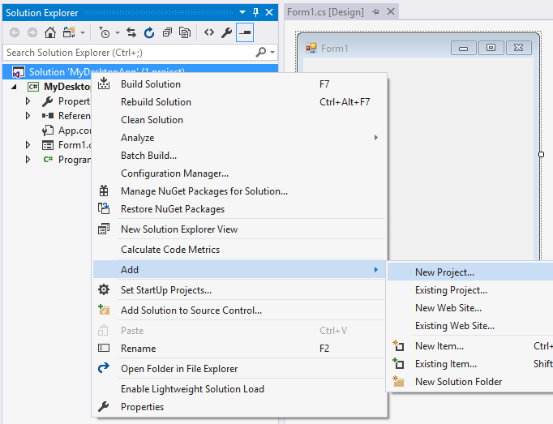

2. In the left pane of the **Add New Project** window, select the **Visual C# | Windows Universal | Blank App (Universal Windows)** project template.

3. In the **Name** box, enter **Microsoft.Knowzy.UWP**.

4. In the **Location** box, verify that you're saving the project to the **Knowzy_Engineering_Win32App\src** folder, and then click **OK**.

    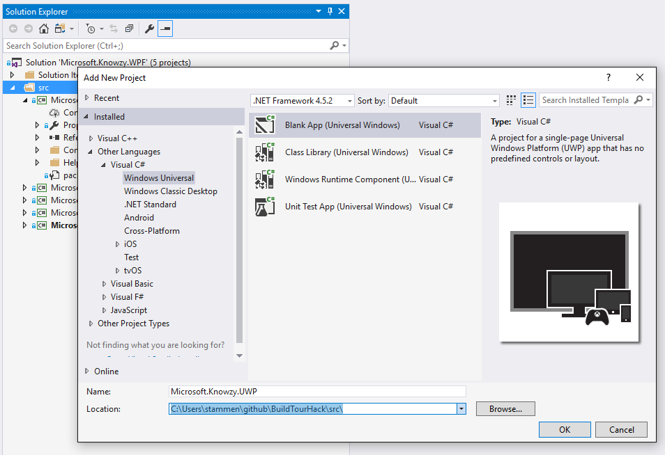

5. In the **New Universal Windows Project** window, verify that **Minimum Version** is set to **Windows 10 Anniversary Update (10.0; Build 14393)** or higher.

    > Note: Desktop Bridge apps require Windows 10 SDK 14393 or higher. If you only have the Windows 10 SDK 15063 installed on    your PC, use **Windows 10 Creators Update (10.0; Build 15063)** for the **Minimum Version**. You don't need to install the Windows 10 SDK 14393 to complete these tasks.

    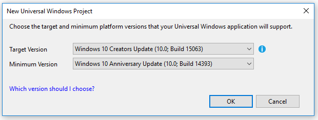

    Your solution should now contain the following projects.

    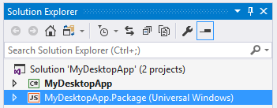

**Add a project dependency to Microsoft.Knowzy.WPF**

1. In Solution Explorer, right-click the **Microsoft.Knowzy.UWP (Universal Windows)** project.

2. Select **Build Dependencies | Project Dependencies..."**

    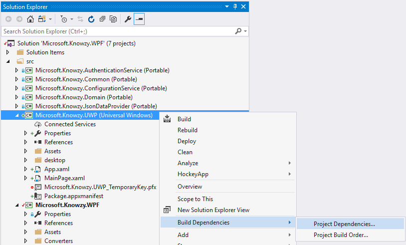

3. In the **Depends on** section of the **Project Dependencies** window, select the **Microsoft.Knowzy.WPF** check box, and then click **OK**.

    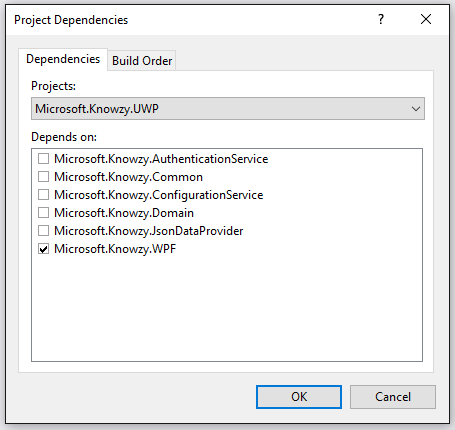

4. Press F7 (or whatever your Build Solution shortcut key is) to build the solution.

**To see what the empty C# UWP app looks like**

1. In Solution Explorer, right-click the **Microsoft.Knowzy.UWP (Universal Windows)** project and select **Debug | Start new instance** to run the UWP app.

2. An empty UWP app window will appear.

3. Close the window to return to Visual Studio 2017.

#### Step 3: Add the Microsoft.Knowzy.WPF binaries to the UWP Project

To convert the Microsoft.Knowzy.WPF app to a Desktop Bridge UWP app, you will need to add all the Win32 binaries created by the Microsoft.Knowzy.WPF app to the Microsoft.Knowzy.UWP app. You will copy them to a folder called **desktop** (this exact name is not required; you can use any name you like), and then package them with the UWP app.

We will automate the Microsoft.Knowzy.WPF project to copy these files after each build, improving the development workflow. We are going to edit the project file Microsoft.Knowzy.WPF.csproj
to include an AfterBuild target that will copy all the Win32 output files to the **desktop** folder in the Microsoft.Knowzy.UWP project as follows:

    <Target Name="AfterBuild">
      <PropertyGroup>
        <TargetUWP>..\Microsoft.Knowzy.UWP\desktop\</TargetUWP>
      </PropertyGroup>
      <ItemGroup>
        <DesktopBinaries Include="$(TargetDir)\**\*.*" />
        <ExcludeFilters Include="$(TargetDir)\**\*.winmd" />
      </ItemGroup>
      <ItemGroup>
        <DesktopBinaries Include="$(TargetDir)\**\*.*" />
      </ItemGroup>
      <ItemGroup>
        <DesktopBinaries Remove="@(ExcludeFilters)" />
      </ItemGroup>
      <Copy SourceFiles="@(DesktopBinaries)" DestinationFiles="@(DesktopBinaries->'$(TargetUWP)\%(RecursiveDir)%(Filename)%(Extension)')" />
    </Target>

This rather complicated bit of XML completes several important tasks:

* The TargetUWP line specifies where to copy the Win32 binaries. In this example, the binaries will be copied to the **desktop** folder in the **Microsoft.Knowzy.UWP** project folder.

* The ExcludeFilters line specifies that any .winmd files in the **Microsoft.Knowzy.WPF** output folder will not be copied to the output directory.

* The DesktopBinaries lines specify that all of the DLL dependencies of the Microsoft.Knowzy.WPF EXE (including the ones from the NuGet packages) will be copied to the output directory.

* The Copy SourceFiles line specifies that the directory structure will be preserved when the files are copied.

**To automate copying the WPF binaries, edit the XML of the Microsoft.Knowzy.WPF.csproj**

1. In Visual Studio, right-click the **Microsoft.Knowzy.WPF** project and select **Unload project**.

    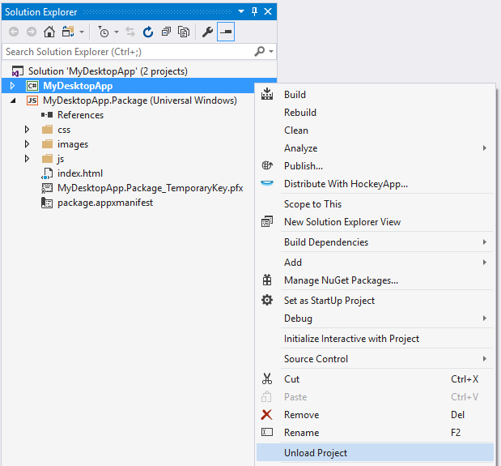

2. Right-click the **Microsoft.Knowzy.WPF** project and select **Edit Microsoft.Knowzy.WPF.csproj**.

    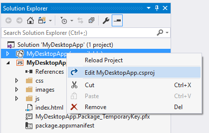

3. Scroll to the end of the XML file and paste the above XML code to the end of the file **before the final project tag**.

4. Save your changes and then reload Microsoft.Knowzy.WPF.

    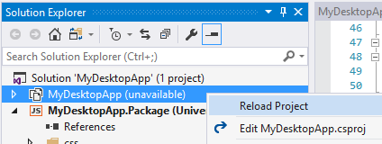

5. Rebuild the solution so the Microsoft.Knowzy.WPF project binaries will be copied to the **Microsoft.Knowzy.UWP/desktop** folder.

Now that the Win32 binaries are copied to the **desktop** folder in the Microsoft.Knowzy.UWP project after the build, we need to add the binaries to the UWP project so they will be packaged with the UWP app.

We will automate this process, similar to how we automated copying the files, as follows:

    <ItemGroup>
      <Content Include="desktop\**\*.*">
        <Link>desktop\%(RecursiveDir)%(FileName)%(Extension)</Link>
        <CopyToOutputDirectory>PreserveNewest</CopyToOutputDirectory>
      </Content>
    </ItemGroup>

This segment of XML completes several important tasks:

* The Content Include line specifies that all of the files in the **desktop** folder will be packaged with the UWP app

* The Link line specifies that the files will be copied to the AppX, preserving their directory structure

**To automate adding the WPF binaries to the UWP project, edit the XML of the Microsoft.Knowzy.UWP.csproj**

1. In Visual Studio, right-click the **Microsoft.Knowzy.UWP** project and select **Unload project**.

2. Right-click the **Microsoft.Knowzy.UWP** project and select **Edit Microsoft.Knowzy.UWP.csproj**.

3. Scroll to the end of the XML file and paste the above XML code to the end of the file **before the final project tag**.

4. Save your changes and then reload Microsoft.Knowzy.UWP.

5. Rebuild the solution so the Microsoft.Knowzy.WPF project binaries will be added to the UWP project and packaged with the UWP app.

6. Verify that the src\Microsoft.Knowzy.UWP folder contains a **desktop** folder. If the folder is missing, close and reopen **Microsoft.Knowzy.WPF.sln**.

You should be able to run the **src\Microsoft.Knowzy.UWP\desktop\Microsoft.Knowzy.WPF.exe** app by navigating to the folder and double-clicking  **Microsoft.Knowzy.WPF.exe**. This will test that all of the dependencies for Microsoft.Knowzy.WPF.exe were copied correctly to the **desktop** folder.

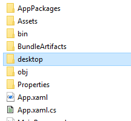

#### Step 4: Edit the Microsoft.Knowzy.UWP package manifest to enable the Desktop Bridge extensions

The Microsoft.Knowzy.UWP project contains a file called **Package.appxmanifest** that describes how to package your UWP app and its dependencies for the Windows Store.

The package manifest is an XML document that contains the info the system needs to deploy, display, or update a Windows app. This info includes package identity, package dependencies, required capabilities, visual elements, and extensibility points. Every UWP app package must include one package manifest.

We need to edit this file so it includes the information needed to run our Win32 WPF app as a UWP app.

To edit the **Package.appxmanifest** XML file, right-click the file in the **Microsoft.Knowzy.UWP** project, and then select **View Code**.

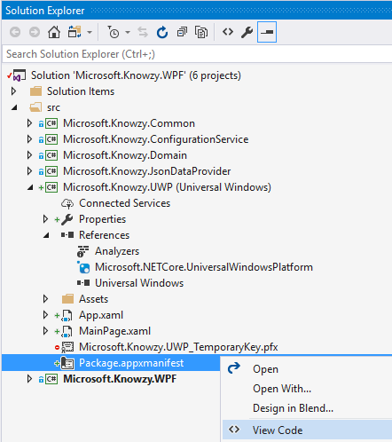

We will now edit the XML to add the Desktop Bridge extensions. This will enable your Win32 app to run as a UWP app.

* Replace the line (near line 7):

        IgnorableNamespaces="uap mp">

    with

        xmlns:rescap="http://schemas.microsoft.com/appx/manifest/foundation/windows10/restrictedcapabilities"
        xmlns:desktop="http://schemas.microsoft.com/appx/manifest/desktop/windows10"
        xmlns:uap4="http://schemas.microsoft.com/appx/manifest/uap/windows10/4"
        IgnorableNamespaces="uap mp rescap desktop">

    Adding these namespaces will allow us to add the Desktop Bridge extensions to our app.

* We need to describe to Windows 10 that our app is a Desktop Bridge app. We also need to specify a minimum version of 13493.
Replace the line (near line 25):

        <TargetDeviceFamily Name="Windows.Universal" MinVersion="10.0.0.0" MaxVersionTested="10.0.0.0" />

    with

        <TargetDeviceFamily Name="Windows.Desktop" MinVersion="10.0.14393.0" MaxVersionTested="10.0.14393.0" />  

* We need to tell Windows 10 that our app is a Desktop Bridge app and needs to run as a Full Trust application. This
capability grants Desktop app capabilities to our UWP app. Add the following capability to the Capabilities section (near line 49)

        <rescap:Capability Name="runFullTrust" />

* We also need to specify that we are a Full Trust application in the Application tag. This tag also points to our WPF EXE as executable for out app.

* Modify the Application tag to the following (near line 34):

        <Application Id="Knowzy" Executable="desktop\Microsoft.Knowzy.WPF.exe" EntryPoint="Windows.FullTrustApplication">

Your package.appxmanifest should now look something like:

    <?xml version="1.0" encoding="utf-8"?>

    <Package
      xmlns="http://schemas.microsoft.com/appx/manifest/foundation/windows10"
      xmlns:mp="http://schemas.microsoft.com/appx/2014/phone/manifest"
      xmlns:uap="http://schemas.microsoft.com/appx/manifest/uap/windows10"
      xmlns:rescap="http://schemas.microsoft.com/appx/manifest/foundation/windows10/restrictedcapabilities"
      xmlns:desktop="http://schemas.microsoft.com/appx/manifest/desktop/windows10"
      xmlns:uap4="http://schemas.microsoft.com/appx/manifest/uap/windows10/4"
      IgnorableNamespaces="uap mp rescap desktop">

      <Identity
        Name="9aed127a-4cd4-4b87-a6a6-4b63499a73cb"
        Publisher="CN=stammen"
        Version="1.0.0.0" />

      <mp:PhoneIdentity PhoneProductId="9aed127a-4cd4-4b87-a6a6-4b63499a73cb" PhonePublisherId="00000000-0000-0000-0000-000000000000"/>

      <Properties>
        <DisplayName>Microsoft.Knowzy.UWP</DisplayName>
        <PublisherDisplayName>stammen</PublisherDisplayName>
        <Logo>Assets\StoreLogo.png</Logo>
      </Properties>

      <Dependencies>
        <TargetDeviceFamily Name="Windows.Desktop" MinVersion="10.0.14393.0" MaxVersionTested="10.0.14393.0" />
      </Dependencies>

      <Resources>
        <Resource Language="x-generate"/>
      </Resources>

      <Applications>
        <Application Id="Knowzy" Executable="desktop\Microsoft.Knowzy.WPF.exe" EntryPoint="Windows.FullTrustApplication">
          <uap:VisualElements
            DisplayName="Microsoft.Knowzy.UWP"
            Square150x150Logo="Assets\Square150x150Logo.png"
            Square44x44Logo="Assets\Square44x44Logo.png"
            Description="Microsoft.Knowzy.UWP"
            BackgroundColor="transparent">
            <uap:DefaultTile Wide310x150Logo="Assets\Wide310x150Logo.png"/>
            <uap:SplashScreen Image="Assets\SplashScreen.png" />
          </uap:VisualElements>
        </Application>
      </Applications>

      <Capabilities>
        <Capability Name="internetClient" />
        <rescap:Capability Name="runFullTrust" />
      </Capabilities>
    </Package>

> Note: Your Publisher, PublisherDisplayName, and other app id properties will be different.

#### Step 5: Deploy and run your converted Win32 App

Your converted Win32 app is now ready to be deployed and run as a UWP app on your computer.

> Note: If your Solution configuration is **Debug | Any CPU**, you will need to enable both the Build and Deploy setting of the Microsoft.Knowzy.UWP app using the Configuration Manager.

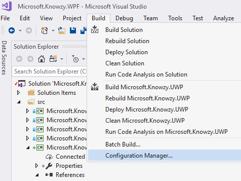

Make sure that the **Build** and **Deploy** check boxes are selected for the  Microsoft.Knowzy.UWP project.

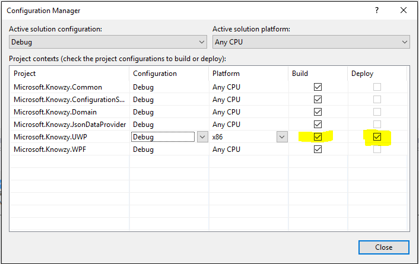

* Right-click the **Microsoft.Knowzy.UWP** project and select **Deploy** from the menu. You will most likely get the following error.

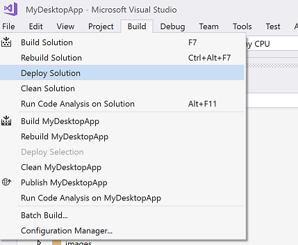

If you try to deploy at this point, you will see an error that says `Applications with custom entry point executables are not supported. Check Executable attribute of the Application element in the package manifest`:

        1>------ Build started: Project: Microsoft.Knowzy.UWP, Configuration: Debug x86 ------
        1>  Microsoft.Knowzy.UWP -> C:\Users\stammen\github\BuildTourHack\src\Microsoft.Knowzy.UWP\bin\x86\Debug\Microsoft.Knowzy.UWP.exe
        1>C:\Program Files (x86)\MSBuild\15.0\.Net\CoreRuntime\Microsoft.Net.CoreRuntime.targets(236,5): error : Applications with custom entry point executables are not supported. Check Executable attribute of the Application element in the package manifest
        ========== Build: 0 succeeded, 1 failed, 0 up-to-date, 0 skipped ==========
        ========== Deploy: 0 succeeded, 0 failed, 0 skipped ==========

Unfortunately there is a bug in the current version of Visual Studio 2017 that prevents **Debug** builds of C# Desktop Bridge apps from being deployed. This bug will be fixed in a future update to Visual Studio 2017.
Until the bug is fixed, we will need to use the **Release** configuration for our C# Desktop Bridge app. We will use the ***Build | Configuration Manager** to set this up.

* Select **Configuration Manager** from the **Build** menu.
* For the Microsoft.Knowzy.UWP project, set the Configuration to **Release**. **You should also do this for the x86 and x64 Platform builds**.

    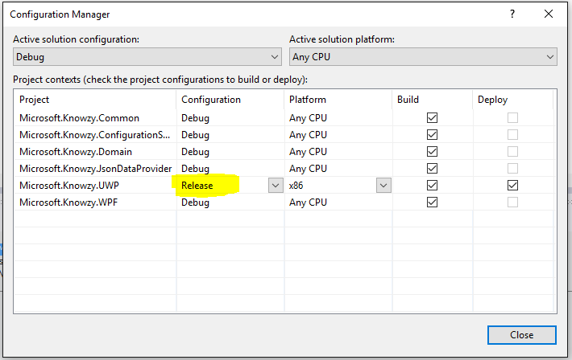

* Right-click the Microsoft.Knowzy.UWP project and select **Deploy** from the menu.

        2>------ Deploy started: Project: Microsoft.Knowzy.UWP, Configuration: Release x86 ------
        2>Creating a new clean layout...
        2>Copying files: Total 11 mb to layout...
        2>Checking whether required frameworks are installed...
        2>Registering the application to run from layout...
        2>Deployment complete (0:00:01.818). Full package name: "9aed127a-4cd4-4b87-a6a6-4b63499a73cb_1.0.0.0_x86__71pt5m19pd38p"
        ========== Build: 1 succeeded, 0 failed, 0 up-to-date, 0 skipped ==========
        ========== Deploy: 1 succeeded, 0 failed, 0 skipped ==========

Your Win32 WPF app has now been packaged as a UWP app using Visual Studio.

In the Windows Start menu, search for **Microsoft.Knowzy.UWP**. If you click the UWP app in the Start menu, **you'll notice that it does not run**. Actually, it did run but it exited immediately due to an error.

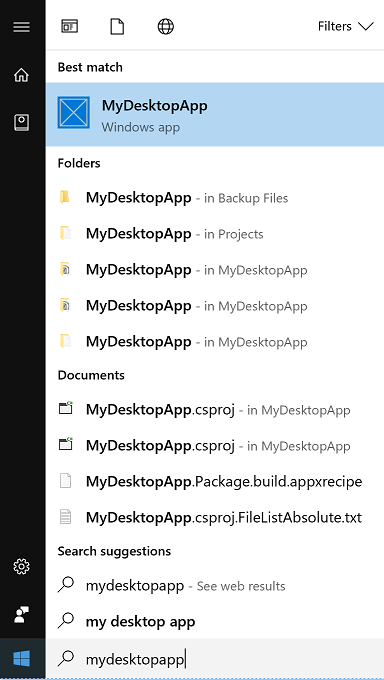

The error is the app cannot load the project.json file it needs to generate the Products list. The app then
throws an exception and exits.

We'll debug this error in a later task, but for now, let's comment out some code so that the app will run.

1. In the **ViewModels** folder of the Microsoft.Knowzy.WPF project, open the **MainViewModel.cs** file.

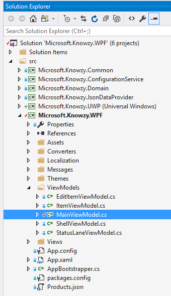

2. Go to the OnViewAttached() method at line 70 and comment out lines 72-75 statement after base.OnActivate();

        protected override void OnViewAttached(object view, object context)
        {
            /*
            foreach (var item in _dataProvider.GetData())
            {
          DevelopmentItems.Add(new ItemViewModel(item, _eventAggregator));
            }
            */

            base.OnViewAttached(view, context);
        }

3. Select **Rebuild Solution** from the **Build** menu.

4. Right-click the **Microsoft.Knowzy.UWP** project and select **Deploy** from the menu.

5. In the Windows Start menu, search for **Microsoft.Knowzy.UWP**. Click **Microsoft.Knowzy.UWP** to launch your app.

The Microsoft.Knowzy.UWP app should now run with the hacked code.

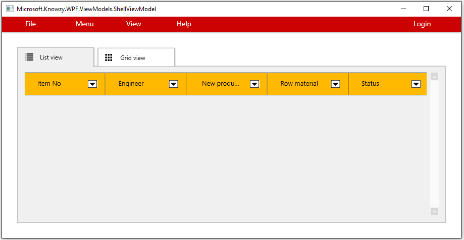

#### Next Step: Debugging your Desktop Bridge app

To fix the error with the project.json file that causes the UWP app to crash, you need to be able to debug the various Knowzy projects. Let's try to debug the Microsoft.Knowzy.UWP project.

1. Right-click the **Microsoft.Knowzy.UWP** project and select **Set as StartUp Project**.

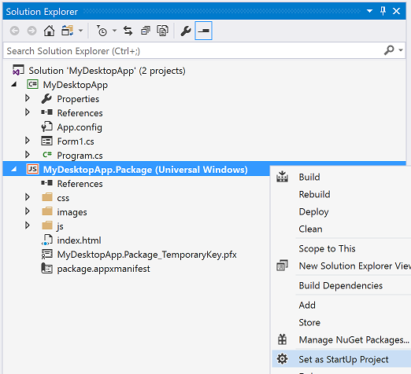

2. Press F5 to start a debugging session for your UWP app. You will probably encounter the following error:

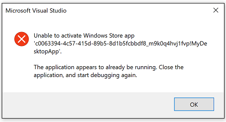

We will fix this error and enable the debugging of our app in the [next task](212_Debugging.md).

## References

* [Package a .NET app using Visual Studio ](https://docs.microsoft.com/en-us/windows/uwp/porting/desktop-to-uwp-packaging-dot-net)

* [BridgeTour Workshop](https://github.com/qmatteoq/BridgeTour-Workshop)

* [Developers Guide to the Desktop Bridge](https://mva.microsoft.com/en-us/training-courses/developers-guide-to-the-desktop-bridge-17373)

## The solution for this task is located [here](https://github.com/Knowzy/KnowzyAppsFinal/tree/master/stories/2/2.1.1)

## Continue to [next task >> ](212_Debugging.md)

