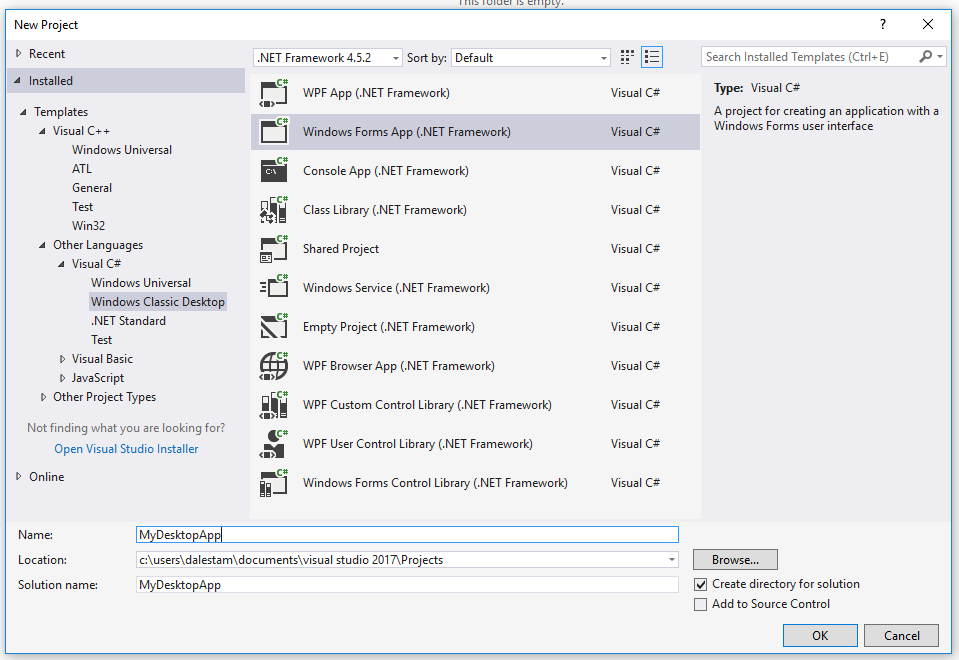
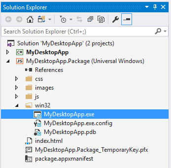
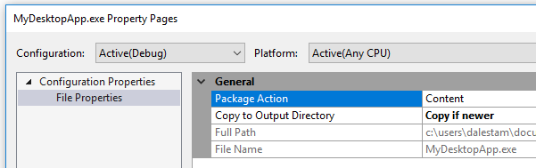

# Task 2.1.1 - Add Centennial support in Visual Studio

This task will guide you through the process of converting a Win32 Desktop app to a UWP App using Visual Studio 2017. 

## Prerequisites 

* Basic knowledge of C# development
* Basic knowledge of client development with the .NET framework
* Basic knowledge of Windows 10 and the Universal Windows Platform
* A computer with Windows 10 Anniversary Update or Windows 10 Creators Update. If you want to use the Desktop App Converter with an installer, you will need at least a Pro or Enterprise version, since it leverages a feature called Containers which isn’t available in the Home version.
* Visual Studio 2017 with the tools to develop applications for the Universal Windows Platform. Any edition is supported, including the free [Visual Studio 2017 Community](https://www.visualstudio.com/vs/community/)

## Task: Add Centennial support in Visual Studio

#### Step 1: Open your existing Win32 Solution with Visual Studio 2017

If you don't have an existing project, create a new C# Windows Classic Desktop Windows Forms App or WPF App project. Name the project MyDesktopApp.



#### Step 2: Add a UWP Project

To create a Desktop Bridge package, add a JavaScript UWP project to the your solution.

Note: even though we are using a JavaScript UWP template, we are not going to write any JavaScript code. We are only using the project as a tool
to convert your Win32 app to a UWP app.

Right-click on the Solution folder and select **Add | New Project...**


Select the **JavaScript | Windows Universal | Blank App (Universal Windows)** project template. Name the project MyDesktopApp.Package.


Make sure the minimum Windows SDK version is **14393** or higher. Windows 10 14393 or higher is required for Desktop Bridge apps.


You solution should now contain 2 projects.


In order for the UWP app to pick up any changes you make to the Win32 app, you should add a Project Build Dependency to the UWP app so it depends on the Win32 app.
Right-click on the MyDesktopApp.Package project and select **Build Dependencies | Project Dependencies...** from the menu.


Select **MyDesktopApp** and click **OK**


Press F7 or select Build Solution from the Visual Studio Build menu. The Win32 and UWP projects will build and the MyDesktopApp Win32 binaries will be copied to the 
win32 folder of the MyDesktopApp.Package project.


#### Step 3: Add the Win32 binaries to the UWP Project

In order to convert your Win32 app to a Desktop Bridge UWP app, you will need to add the binaries created by your app to the JavaScript UWP app. 
We are going to use the JavaScript UWP app to create the app package that will eventually be submitted to the Windows Store.

All the Win32 binaries will be stored in your UWP project in a folder called win32 (though this exact name is not required; you can use any name you like).
You can automate the project to copy the files after each build, improving your development workflow. Edit your project file (MyDesktopApp.csproj in this example) 
to include an AfterBuild target that will copy all the Win32 output files to the win32 folder in the UWP project as follows:

```xml
  <Target Name="AfterBuild">
    <PropertyGroup>
      <TargetUWP>..\MyDesktopApp.Package\win32\</TargetUWP>
    </PropertyGroup>
     <ItemGroup>
       <Win32Binaries Include="$(TargetDir)\*" />
     </ItemGroup>
    <Copy SourceFiles="@(Win32Binaries)" DestinationFolder="$(TargetUWP)" />
  </Target>
```

You can edit the MyDesktopApp.csproj in Visual Studio by right clicking on the project and selecting **Unload project**


Right-click again on MyDesktopApp.csproj and select **Edit MyDesktopApp.csproj**


Scroll to the end of the xml file and paste the above xml code to the end of the file before the final project tag.

```xml
  <Target Name="AfterBuild">
    <PropertyGroup>
      <TargetUWP>..\MyDesktopApp.Package\win32\</TargetUWP>
    </PropertyGroup>
    <ItemGroup>
      <Win32Binaries Include="$(TargetDir)\*" />
    </ItemGroup>
    <Copy SourceFiles="@(Win32Binaries)" DestinationFolder="$(TargetUWP)" />
  </Target>
</Project>
```

Save your changes and then reload MyDesktopApp.csproj.


Now that the Win32 binaries are copied to the UWP project after a build, we need to add the binaries to the UWP project so they will be packaged with the UWP app.
We can automate this process by editing the MyDesktopApp.Package.jsproj project. Following the same procedure you just completed when editing the MyDesktopApp.csproj file, 
you will unload, edit and reload the MyDesktopApp.Package.jsproj project file. Add the following XML to the end of the MyDesktopApp.Package.jsproj project file.

```xml
  <ItemGroup>
    <Content Include="win32\*.dll">
      <Link>win32\%(RecursiveDir)%(FileName)%(Extension)</Link>
      <CopyToOutputDirectory>PreserveNewest</CopyToOutputDirectory>
    </Content>
    <Content Include="win32\*.exe">
      <Link>win32\%(RecursiveDir)%(FileName)%(Extension)</Link>
      <CopyToOutputDirectory>PreserveNewest</CopyToOutputDirectory>
    </Content>
    <Content Include="win32\*.config">
      <Link>win32\%(RecursiveDir)%(FileName)%(Extension)</Link>
      <CopyToOutputDirectory>PreserveNewest</CopyToOutputDirectory>
    </Content>
    <Content Include="win32\*.pdb">
      <Link>win32\%(RecursiveDir)%(FileName)%(Extension)</Link>
      <CopyToOutputDirectory>PreserveNewest</CopyToOutputDirectory>
    </Content>
  </ItemGroup>
```

After you reload the MyDesktopApp.Package.jsproj project file, your project should now contain the Win32 binaries from your desktop app.



Right click on the MyDesktopApp.exe file and select **Properties**. In the Properties window notice that the file is marked Content and Copy if newer is enabled.
These settings will ensure that your Win32 binaries will become part of the UWP app's AppX package.



#### Step 4: Edit the App Manifest to enable the Desktop Bridge Extensions

The MyDesktopApp.Package project contains a file called package.appxmanifest that describes how to package your app for the Windows Store and its dependencies.
We need to edit this file so it 


	
## References

* https://docs.microsoft.com/en-us/windows/uwp/porting/desktop-to-uwp-packaging-dot-net 
* https://github.com/qmatteoq/BridgeTour-Workshop
* https://mva.microsoft.com/en-us/training-courses/developers-guide-to-the-desktop-bridge-17373