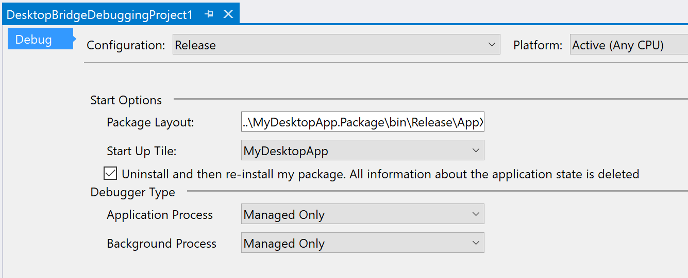

# Task 2.1.2 - Debugging a Windows Desktop Bridge App

This task will guide you through the process of debugging a Windows Desktop Bridge App using Visual Studio 2017. 

## Prerequisites 

* Basic knowledge of C# development
* Basic knowledge of client development with the .NET framework
* Basic knowledge of Windows 10 and the Universal Windows Platform
* A computer with Windows 10 Anniversary Update or Windows 10 Creators Update. If you want to use the Desktop App Converter with an installer, you will need at least a Pro or Enterprise version, since it leverages a feature called Containers which isn’t available in the Home version.
* Visual Studio 2017 with the tools to develop applications for the Universal Windows Platform. Any edition is supported, including the free [Visual Studio 2017 Community](https://www.visualstudio.com/vs/community/)
* The [Desktop Bridge Debugging Project template](https://marketplace.visualstudio.com/items?itemName=VisualStudioProductTeam.DesktoptoUWPPackagingProject) installed into Visual Studio 2017


## Step 1: Install the Desktop Bridge Debugging Project Extension

If you do not have the Desktop Bridge Debugging Project extension installed into Visual Studio 2017, please complete the following steps:

1. Click on the **Tools** menu and select **Extensions and Updates...**


2. Select **Online** and enter **Desktop Bridge Debugging Project** in the search field. Click **Download**.


3. Close Visual Studio 2017 and the Desktop Bridge Debugging Project Extension will be installed.

4. Reopen your Desktop Bridge solution from the [Add Centennial Support using Visual Studio 2017](211_Centennial.md) task.

## Step 2: Add the Desktop Bridge Debugging Project to the Solution

Right-click on the Solution folder and select **Add | New Project...**


Select the **Other Project Types | Desktop Bridge Debugging Project** project template. Name the project DesktopBridgeDebuggingProject1.


You solution should now contain 3 projects.


## Step 3: Configure the Desktop Bridge Debugging Project

Right-click on the DesktopBridgeDebuggingProject1 project and select **Set as Startup Project**. 


Right-click on the DesktopBridgeDebuggingProject1 project and select **Properties*. 

For Debug builds use the following settings:

* Package Layout: ..\MyDesktopApp.Package\bin\Debug\AppX
* Select Uninstall and then re-install my package.


For Release builds use the following settings:

* Package Layout: ..\MyDesktopApp.Package\bin\Release\AppX
* Select Uninstall and then re-install my package.



Close the Properties windows.

Open the AppXPackageFileList.xml file in the DesktopBridgeDebuggingProject1 project


Modify the xml to the following:

```xml
<?xml version="1.0" encoding="utf-8"?>
<Project ToolsVersion="14.0"
         xmlns="http://schemas.microsoft.com/developer/msbuild/2003">
  <PropertyGroup>
    <MyProjectOutputPath>$(PackageLayout)</MyProjectOutputPath>
  </PropertyGroup>
  <ItemGroup>
    <LayoutFile Include="$(MyProjectOutputPath)\win32\MyDesktopApp.exe">
      <PackagePath>$(PackageLayout)\win32\MyDesktopApp.exe</PackagePath>
    </LayoutFile>
  </ItemGroup>
</Project>
```
Save your changes. Now press F5 and your UWP app will now be deployed and launch successfully. You should now be able to set breakpoints in the Win32 MyDesktop App source code.


## References
* https://docs.microsoft.com/en-us/windows/uwp/porting/desktop-to-uwp-debug
* https://github.com/Microsoft/DesktopBridgeToUWP-Samples 
* https://docs.microsoft.com/en-us/windows/uwp/porting/desktop-to-uwp-packaging-dot-net 
* https://github.com/qmatteoq/BridgeTour-Workshop
* https://mva.microsoft.com/en-us/training-courses/developers-guide-to-the-desktop-bridge-17373
