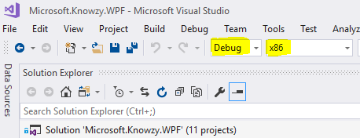
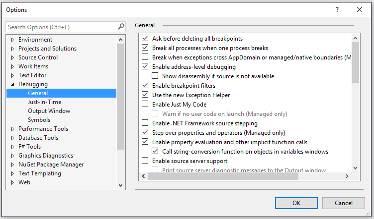
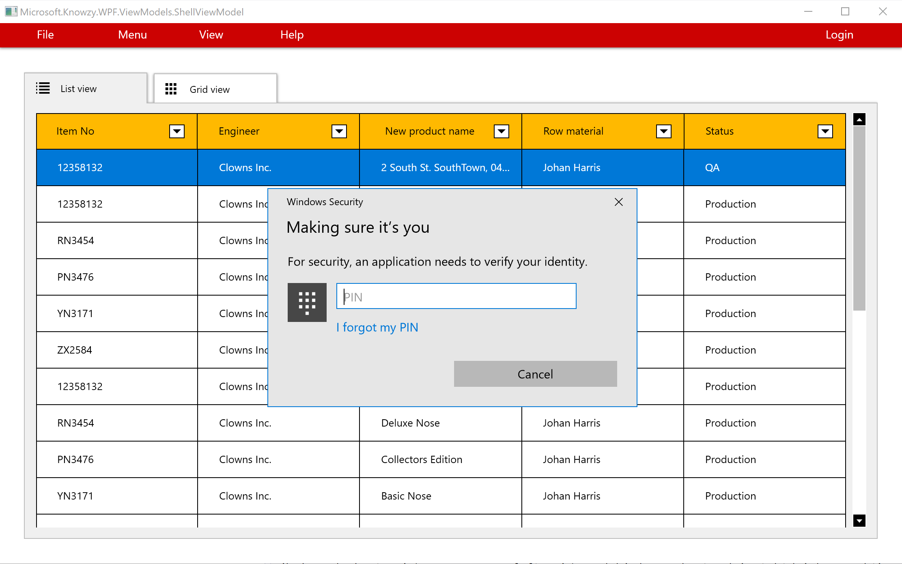
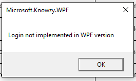

# Task 2.1.4 - Integrate Windows Hello Authentication

This task will guide you through the process of adding the Windows Hello UWP API to your Win32 Desktop app using Visual Studio 2017. 
We will also add support for presenting Windows 10 UWP Toast notifications to the user. 

## What is Windows Hello?
[Windows Hello](https://docs.microsoft.com/en-us/windows/uwp/security/microsoft-passport) is the name Microsoft has given to the new biometric sign-in system built into Windows 10. Because it is built directly into the operating system, Windows Hello allows face or fingerprint identification to unlock users' devices. Authentication happens when the user supplies his or her unique biometric identifier to access the device-specific credentials, which means that an attacker who steals the device can't log on to it unless that attacker has the PIN. The Windows secure credential store protects biometric data on the device. By using Windows Hello to unlock a device, the authorized user gains access to all of his or her Windows experience, apps, data, websites, and services.
The Windows Hello authenticator is known as a Hello. A Hello is unique to the combination of an individual device and a specific user. It does not roam across devices, is not shared with a server or calling app, and cannot easily be extracted from a device. If multiple users share a device, each user needs to set up his or her own account. Every account gets a unique Hello for that device. You can think of a Hello as a token you can use to unlock (or release) a stored credential. The Hello itself does not authenticate you to an app or service, but it releases credentials that can. In other words, the Hello is not a user credential but it is a second factor for the authenticating process.

Windows Hello is shipping as part of the Windows 10 operating system and developers can implement this technology to protect their Universal Windows Platform (UWP) apps and backend services. 

## Prerequisites 

* Basic knowledge of C# development

* Basic knowledge of client development with the .NET framework

* Basic knowledge of Windows 10 and the Universal Windows Platform

* A computer with Windows 10 Anniversary Update or Windows 10 Creators Update. If you want to use the Desktop App Converter with an installer, you will need at least a Pro or Enterprise version, since it leverages a feature called Containers which is not available in the Home version.

* Visual Studio 2017 with the tools to develop applications for the Universal Windows Platform. Any edition is supported, including the free [Visual Studio 2017 Community](https://www.visualstudio.com/vs/community/)

* Complete the section on [Adding Windows 10 UWP APIs to your Desktop Bridge App](213_AddUwp.md)

## Task

We will use the Desktop Bridge Knowzy application which was created in the previous tasks as a starting point.
To get started, please open the **Microsoft.Knowzy.WPF.sln** in the **src\Knowzy_Engineering_Win32App** folder with Visual Studio 2017.

>Note: If you are starting with this from the **2.1.3** solution, you will need to do the following:

* Set the Build configuration to **Debug | x86**

    

* Select **Options** from the **Debug** menu, From the **Debugging | General** Tab,  disable the **Enable Just My Code** option.

    

* Set the **Microsoft.Knowzy.Debug** project as the startup project.

Verify these settings before you continue with this task.

#### Step 1: Add a New UWP Helper Class for Windows Hello

Following the techniques presented in the previous task, we are going to add the Windows 10 UWP code for the Windows Hello API and Toast notifications as helper classes.
These helper classes can be accessed by the Knowzy app when it is running as a Desktop Bridge UWP app.

* Add a new C# class to the Microsoft.Knowzy.UwpHelpers project. Name the file WindowsHello.cs.

* Add the following code to WindowsHello.cs. This code uses methods from the Windows 10 UWP API

        using System;
        using System.Collections.Generic;
        using System.Linq;
        using System.Text;
        using System.Threading.Tasks;
        using Windows.Security.Credentials;

        namespace Microsoft.Knowzy.UwpHelpers
        {
            public class WindowsHello
            {
                public static async Task<bool> Login()
                {
                    var result = await KeyCredentialManager.IsSupportedAsync();
                    String message;

                    if (result)
                    {
                        var authenticationResult = await KeyCredentialManager.RequestCreateAsync("login", KeyCredentialCreationOption.ReplaceExisting);
                        if (authenticationResult.Status == KeyCredentialStatus.Success)
                        {
                            message = "User is logged in";
                        }
                        else
                        {
                            message = "Login error: " + authenticationResult.Status;
                        }
                    }
                    else
                    {
                        message = "Windows Hello is not enabled for this device.";
                    }

                    String imagePath = Windows.ApplicationModel.Package.Current.InstalledLocation.Path;
                    String xml = "<toast><visual><binding template='ToastGeneric'><text hint-maxLines='1'>" + message + "</text></binding></visual></toast>";

                    Toast.CreateToast(xml);

                    return result;
                }
            }
        }

This is only a starting point for Windows Hello support but it is sufficient to demonstrate how to add Windows 10 UWP APIs to your Desktop Bridge App. You will have the opportunity to complete coding
a Windows Hello login in a later task.

#### Step 2: Add a New UWP Helper Class for Toast Notifications

The previous code example for Windows Hello uses a [Toast](https://docs.microsoft.com/en-us/windows/uwp/controls-and-patterns/tiles-and-notifications-adaptive-interactive-toasts) notification to indicated to the user
if they are logged in. We need to add a UWP Helper class for Toasts.

* Add a new C# class to the Microsoft.Knowzy.UwpHelpers project. Name the file Toast.cs.

* Add the following code to Toast.cs. This code uses methods from the Windows 10 UWP API

        using System;
        using System.Collections.Generic;
        using System.Diagnostics;
        using System.Linq;
        using System.Text;
        using System.Threading.Tasks;
        using Windows.Data.Xml.Dom;
        using Windows.UI.Notifications;

        namespace Microsoft.Knowzy.UwpHelpers
        {
            public class Toast
            {
                static ToastNotification toast = null;
                static ToastNotifier notifier = null;

                public static void CreateToast(String xml)
                {
                    if (!ExecutionMode.IsRunningAsUwp())
                    {
                        return;
                    }

                    try
                    {
                        if (notifier == null)
                        {
                            notifier = ToastNotificationManager.CreateToastNotifier();
                        }
                        else
                        {
                            notifier.Hide(toast);
                        }
                        XmlDocument toastXml = new XmlDocument();
                        toastXml.LoadXml(xml);

                        toast = new ToastNotification(toastXml);
                        notifier.Show(toast);
                    }
                    catch (Exception ex)
                    {
                        Debug.WriteLine("CreateToast Error:" + ex.Message);
                    }
                }
            }
        }

#### Step 3: Add a Reference to Microsoft.Knowzy.UwpHelpers

* Right-click on the Microsoft.Knowzy.WPF project and select **Add | Reference...** and select the Microsoft.Knowzy.UwpHelpers project. Click **OK**.

#### Step 4: Add Login Code to the WPF App

When the Login menu item in clicked in the UI of the Knowzy app, a message to open the Login dialog is sent to the  Handle(OpenLoginMessage message) method in
Microsoft.Knowzy.WPF\ViewModels\ShellViewModel.cs.

* Open the file Microsoft.Knowzy.WPF\ViewModels\ShellViewModel.cs and find the Handle(OpenLoginMessage message) method near line 78.

* Modify the Handle(OpenLoginMessage message) as follows:

        using Microsoft.Knowzy.UwpHelpers;

        public async void Handle(OpenLoginMessage message)
        {
            if (ExecutionMode.IsRunningAsUwp())
            {
                await WindowsHello.Login();
            }
            else
            {
                _windowManager.ShowDialog(_loginViewModel);
            }
        }

* Build and run the solution (with Windows.Knowzy.Debug as the startup project)

* Click on the Login Menu item. 

    * If your computer is capable of running the Windows Hello Login you will be presented with the Windows Hello Login interface.
    
    * If your computer is not capable of running the Windows Hello Login, a Toast will appear in the lower left corner of your screen.
    
    

 
* Run just the WPF version (right-click on the Microsoft.Knowzy.WPF project and select Debug | Start new instance). Clicking on the Login button will show:

Please note that this is not a complete implementation of Windows Hello login. For more information, please go [here](https://docs.microsoft.com/en-us/windows/uwp/security/microsoft-passport).

We will continue to add more Windows 10 UWP features to our app in the [next task](221_XAMLView.md).

## References

* [Windows Hello](https://docs.microsoft.com/en-us/windows/uwp/security/microsoft-passport)

* [Tiles, badges, and notifications for UWP apps](https://docs.microsoft.com/en-us/windows/uwp/controls-and-patterns/tiles-badges-notifications)

* [Adaptive and interactive toast notifications](https://docs.microsoft.com/en-us/windows/uwp/controls-and-patterns/tiles-and-notifications-adaptive-interactive-toasts)

## The solution for this task is located [here](https://github.com/Knowzy/KnowzyAppsFinal/tree/master/stories/2/2.1.4)

## continue to [next task >> ](221_XAMLView.md)
