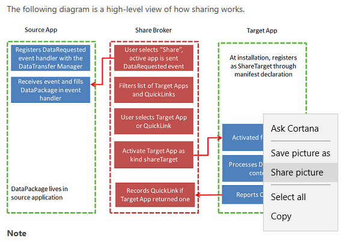
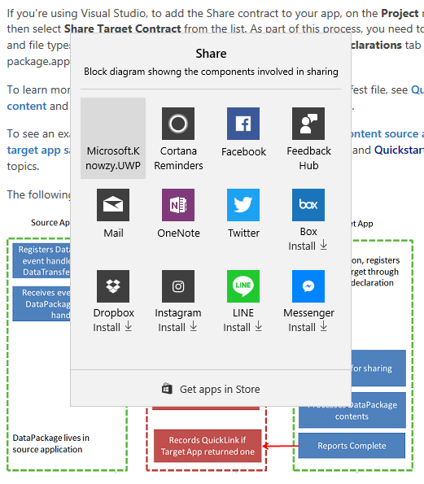
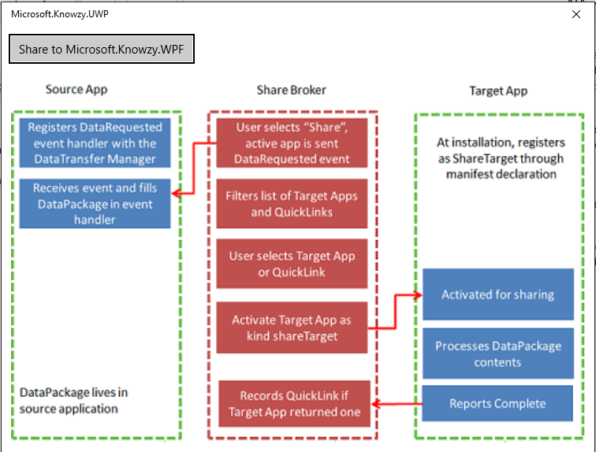
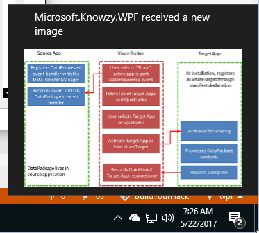

# Task 2.2.2 -  Add support for other apps to share images with the Knowzy App

Our development department has the idea to allow Knowzy app users to share images from other Windows 10 applications with the Knowzy app. 
For now, we just want you to implement the Windows 10 sharing code. To show that the image was shared with the Knowzy app, please display a toast
with the image.

Requirements for this task:
* Share an image from another Windows 10 App. The Knowzy app should appear as one of the options for Share Targets.

* Display a XAML UI for sharing with the Knowzy app.

* Display a Toast that displays the image after the sharing operation has completed.

Our research has found a starting point for the sharing idea [here](https://blogs.windows.com/buildingapps/2017/02/01/adding-uwp-features-existing-pc-software/#vEJwTPxsf80CZvOh.97)
under the "Making your PC software a share target" section.

We also found some [sample code](https://github.com/Microsoft/DesktopBridgeToUWP-Samples/tree/master/Samples/WPFasShareTarget).

## Prerequisites 

This task has a dependency on [Task 2.2.1](221_XAMLView.md) and all of it's prerequisites

* Make sure the Microsoft.Knowzy.WPF.sln Build configuration to **Debug | x86**

* Set the **Microsoft.Knowzy.Debug** project as the startup project.

## Task 

1. You will need to add a sharing extension to the Extension section of the Application tag in Package.appxmanifest in the Microsoft.Knowzy.UWP project to enable the app to be an image share target. 
You also need to specify that you are a share target that supports Bitmap images.
 

        <uap:Extension Category="windows.shareTarget" Executable="Microsoft.Knowzy.UWP.exe" EntryPoint="Microsoft.Knowzy.UWP.App">
          <uap:ShareTarget>
            <uap:SupportedFileTypes>
              <uap:SupportsAnyFileType />
            </uap:SupportedFileTypes>
            <uap:DataFormat>Bitmap</uap:DataFormat>
          </uap:ShareTarget>
        </uap:Extension>
    
1. You will need to add an OnShareTargetActivated event handler to App.xaml.cs in the Microsoft.Knowzy.UWP project. This handler will be called when a user attempts to share an image to the Knowzy app.
It should look something like:

        protected override void OnShareTargetActivated(ShareTargetActivatedEventArgs e)
        {
            Frame rootFrame = new Frame();
            Window.Current.Content = rootFrame;
            rootFrame.Navigate(typeof(SharePage), e.ShareOperation);
            Window.Current.Activate();
        }

1. You will need to add a new XAML page to the Microsoft.Knowzy.UWP project. Right click on the project and select **Add | New Item...**. Choose the **Blank Page** template and name it **SharePage.xaml**.

1. You will need to add the Sharing UI to the SharePage.xaml file. For now, use something like:

        <Grid Background="{ThemeResource ApplicationPageBackgroundThemeBrush}" Margin="12">
            <StackPanel>
                <Button Content="Share to Microsoft.Knowzy.WPF" Click="ShareButton_Click"/>
                <TextBlock x:Name="tbFileName" />
                <Image x:Name="img"/>
            </StackPanel>
        </Grid>

1. In the file SharePage.xaml.cs you will need to handle the OnNavigatedTo event. The NavigationEventArgs parameter will contain the shared image information. Display the shared image in the
SharedPage UI. Pay attention to threading issues such as processing the image in a separate task. Also, you can only update the XAML UI image on the UI thread so you will need to use a dispacther to update the UI.

        // add the following using directives
        using System.Diagnostics;
        using System.Threading.Tasks;
        using Windows.ApplicationModel.DataTransfer;
        using Windows.ApplicationModel.DataTransfer.ShareTarget;
        using Windows.Storage;
        using Windows.UI.Core;
        using Windows.UI.Xaml.Media.Imaging;

        // add the following private members to the SharePage class
        private ShareOperation operation = null;
        private StorageFile file = null;
        
        // Add the following method to the SharePage class
        protected override async void OnNavigatedTo(NavigationEventArgs args)
        {
            if (args.Parameter != null)
            {
                // It is recommended to only retrieve the ShareOperation object in the activation handler, return as
                // quickly as possible, and retrieve all data from the share target asynchronously.
                operation = (ShareOperation)args.Parameter;

                await Task.Factory.StartNew(async () =>
                {
                    if (operation.Data.Contains(StandardDataFormats.StorageItems))
                    {
                        var storageItems = await operation.Data.GetStorageItemsAsync();
                        file = (StorageFile)(storageItems[0]);
                        var stream = await file.OpenReadAsync();
                        // Get back to the UI thread using the dispatcher.
                        await Dispatcher.RunAsync(CoreDispatcherPriority.Normal, async () =>
                        {
                            var image = new BitmapImage();
                            img.Source = image;
                            await image.SetSourceAsync(stream);
                        });
                    }
                });
            }
        }

1. Up to this point, the user has only shared the image with the UWP version of Knowzy. We need to share the image so it can be accessed by the WPF version of Knowzy. The SharePage UI includes a "Share to Knowzy WPF" 
button that will trigger this sharing operation. Add a "ShareButton_Click" event handler to SharePage.xaml.cs. Please note the location of the sharing folder. ApplicationData.Current.LocalFolder. More information on
this folder is available [here](https://docs.microsoft.com/en-us/uwp/api/windows.storage.applicationdata).

        private async void ShareButton_Click(object sender, RoutedEventArgs e)
        {
            if (file != null)
            {
                // copy file to app's local folder. Desktop Bridge app will detect new file with its FileWatcher
                try
                {
                    await file.CopyAsync(ApplicationData.Current.LocalFolder, file.Name, NameCollisionOption.ReplaceExisting);
                }
                catch (Exception ex)
                {
                    Debug.WriteLine("ShareButton_Click Error:" + ex.Message);
                }
            }

            if (operation != null)
            {
                operation.ReportCompleted();
            }
        }

1. Now that the image has been copied to the ApplicationData.Current.LocalFolder, the Knowzy WPF app needs to be able to detect that an image has been shared. 
We will use a FileSystemWatcher to detect when an image has been to the ApplicationData.Current.LocalFolder. We will make this a feature that is only supported
when the app is running as a Desktop Bridge app. Add the following code to Views\MainView.xaml.cs in the Microsoft.Knowzy.WPF project:

        using System;
        using System.Diagnostics;
        using System.IO;
        using Microsoft.Knowzy.UwpHelpers;

        public MainView()
        {
            InitializeComponent();

            if (ExecutionMode.IsRunningAsUwp())
            {
            try
                {
                    // get the path to the App folder (WPF or UWP).
                    var path = AppFolders.Local;
                    FileSystemWatcher watcher = new FileSystemWatcher(path);
                    watcher.EnableRaisingEvents = true;
                    watcher.Changed += Watcher_Changed;
                }
                catch(Exception ex)
                {
                    Debug.WriteLine("FileSystemWatcher Error:" + ex.Message);
                }
            }
        }

1. Add the FileSystemWatcher event handler to MainView.xaml.cs in the Microsoft.Knowzy.WPF project:

        private void Watcher_Changed(object sender, FileSystemEventArgs e)
        {
            if (ExecutionMode.IsRunningAsUwp())
            {
                if (File.Exists(e.FullPath))
                {
                    var xml = "<toast><visual><binding template='ToastGeneric'><image src='" + e.FullPath + "'/><text hint-maxLines='1'>Microsoft.Knowzy.WPF received a new image</text></binding></visual></toast>";
                    Toast.CreateToast(xml);
                }
            }
        }

1. You will need to add a getter to AppFolders.cs in Microsoft.Knowzy.UwpHelpers to return the path to Windows.Storage.ApplicationData.Current.LocalFolder. 

    Add the following code to AppFolders.cs

        public static string Local
        {
            get
            {
                string path = null;
                if (ExecutionMode.IsRunningAsUwp())
                {
                    path = GetSafeAppxLocalFolder();
                }
                return path;
            }
        }

        internal static string GetSafeAppxLocalFolder()
        {
            try
            {
                return Windows.Storage.ApplicationData.Current.LocalFolder.Path;
            }
            catch (Exception ex)
            {
                System.Diagnostics.Debug.WriteLine(ex.Message);
            }
            return null;
        }
    
1. Once you have made all of your changes to to code, build and run the Microsoft.Knowzy.Debug project.

* Open an Windows 10 application that is capable of sharing a picture (Microsoft Edge). Navigate to a picture you want to share.

* Right click on the image and select **Share picture**

    

* In the list of apps that are iamge share targets, select Microsoft.Know.UWP

    

* The Microsoft.Knowzy.UWP SharePage will appear and display the image. Click on the **Share to Microsoft.Knowzy.WPF** button.

    

* The FileSystemWatcher in the Microsoft.Knowzy.WPF app will be notified that a new image has been shared to the app. It will then display the toast with the image.

    

We will continue to add more Windows 10 UWP features to our app in the [next task](223_AppServices.md).

## References
* [Share data](https://docs.microsoft.com/en-us/windows/uwp/app-to-app/share-data)

* [Sharing content target app sample](https://github.com/Microsoft/Windows-universal-samples/blob/master/Samples/ShareTarget) 

* [Sharing content source app sample](https://github.com/Microsoft/Windows-universal-samples/blob/master/Samples/ShareSource)

* [Adding UWP features to your existing PC software](https://blogs.windows.com/buildingapps/2017/02/01/adding-uwp-features-existing-pc-software/#vEJwTPxsf80CZvOh.97)

* [WPF picture viewer as a share target](https://github.com/Microsoft/DesktopBridgeToUWP-Samples/tree/master/Samples/WPFasShareTarget)

## The solution for this task is located [here](https://github.com/Knowzy/KnowzyAppsFinal/tree/master/stories/2/2.2.2)

## continue to [next task >> ](223_AppServices.md)
