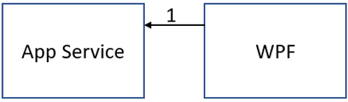
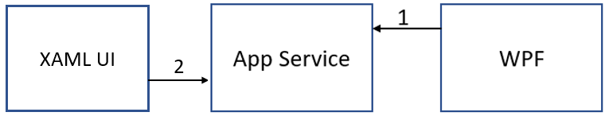
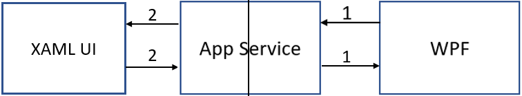
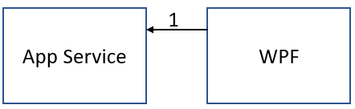
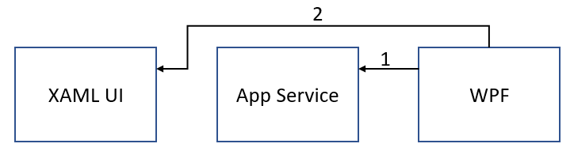
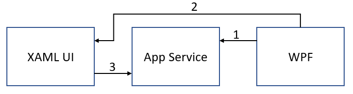
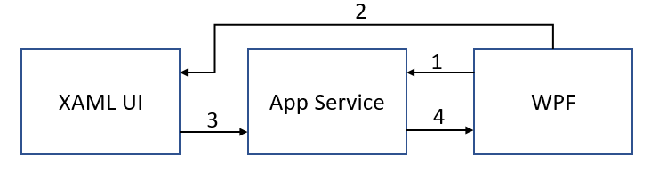
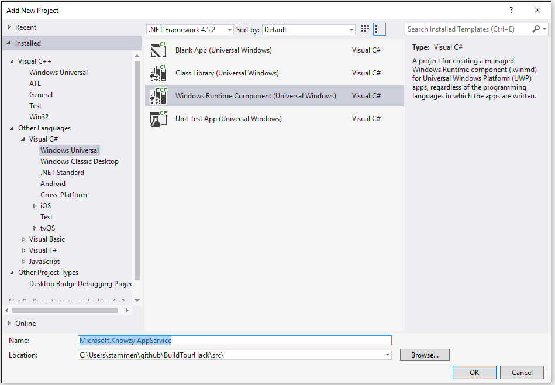
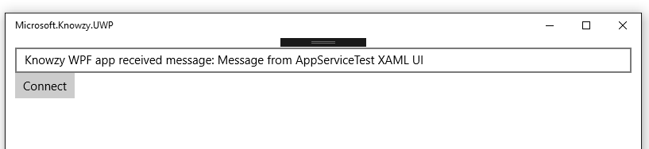

# Task 2.2.3 -  Adding App Services to the Knowzy Desktop Bridge App

Our development department has identified a problem with the Desktop Bridge version of the Knowzy app.

1. There appears to be no way to implement bi-directional communication between the WPF code and the UWP code of the Knowzy app.

    * We can send Uri protocol messages to the UWP code using Windows.System.Launcher.LaunchUriAsync(uri) but we can't receive a response.
    
    * [Windows.System.Launcher.LaunchUriForResultsAsync](https://docs.microsoft.com/en-us/uwp/api/windows.system.launcher) seems to be a solution as it returns a response to the request
but LaunchUriForResultsAsync is not supported in DesktopBridge applications.
   
It appears that a Windows 10 UWP [App Service](https://docs.microsoft.com/en-us/windows/uwp/launch-resume/app-services) will allow data to be shared between a UWP app and a WPF app. There is an example of 
this sharing scenario [here](https://blogs.windows.com/buildingapps/2017/02/01/adding-uwp-features-existing-pc-software/#QkPeOqgHqG1fdHOa.97) 
in the "Exposing an App Service" section. However, this example requires that we move some of our WPF source code into the App Service. Also there is no example of 
how to share data between the UWP and WPF portions of our app. 

Here is the problem with the communications between the WPF and UWP parts of our DeskTop Bridge app using an App Service.

1. The WPF app starts and connects to the App Service

    

1. The XAML UI starts up and connects to the App Service

    

1. The WPF app sends a request to the App Service. It can only receive a reply from the App Service. The request is not sent to the XAML UI.
Likewise, if the XAML UI makes a request to the App Service, that request is not forwarded to the WPF app. Each app can only receive a reply from
the App Service. Each connection from an app to the App Service may also be running a separate instance of the App Servce so the two connections are not
aware of each other.

    

There is a solution to this problem if we make Microsoft.Knowzy.UWP.exe the startup app for our DeskTop Bridge app. However, we are not ready to make the UWP version since we have not ported the WPF UI to the UWP app.
We still need the WPF app to be the UI for our desktop bridge app. So we will need to modify our App Service to bridge the communication between the WPF and UWP portions of our Desktop Bridge app.

Requirements for this task:

* Create an App Service that enables the sharing of the Product information.

* Share Clown nose product information between the UWP XAML UI and the WPF Knowzy application.

* Share Clown nose product information from the WPF Knowzy application and an external Windows 10 UWP application.

We want to implement the following App Service  scenario:

1. The WPF app launches the Windows 10 App Service and registers itself to the App Service as a listener with a unique listener id.

    

1. The WPF app opens the UWP XAML UI using Windows.System.Launcher.LaunchUriAsync(uri) and sends the listener id as a parameter.

    

1. The UWP Xaml UI connects to the App Service, does its work, and sends the response data to the App Service along with the listener id.

    

1. The App Service sends the response data to the listener with the specified listener id.

    

Our research has found a starting point for the App Service idea [here](https://docs.microsoft.com/en-us/windows/uwp/launch-resume/how-to-create-and-consume-an-app-service).
You will need to modify this code to enable bi-directional communication between the UWP Xaml ui and the WPF application code.

We also found some App Service sample code [here](https://github.com/Microsoft/Windows-universal-samples/blob/master/Samples/AppServices).

## Prerequisites 

This task has a dependency on [Task 2.2.1](221_XAMLView.md) and all of it's prerequisites

Since this will be quite a complicated task, it is recommended that you work through the [Create and consume an app service tutorial](https://docs.microsoft.com/en-us/windows/uwp/launch-resume/how-to-create-and-consume-an-app-service).
This tutorial will familiarize you with the following:

1. How to create an App Service project and add it to your solution.

1. How to specify the App Service in the Package.appxmanifest.

1. How to open a connection to an App Service.

1. How to send a request to an App Service.

1. How to receive a message from an App Service.

Once you have completed the tutorial, you will be ready to add an App Service to the Knowzy DeskTop Bridge app.

* Make sure the Microsoft.Knowzy.WPF.sln Build configuration to **Debug | x86**

* Set the **Microsoft.Knowzy.Debug** project as the startup project.

## Task 

#### Create the App Service Project ####

* Right-click on the src folder in the Microsoft.Knowzy.WPF solution and select **Add | New Project...**

* Select the **Visual C# | Windows Univeral | Windows Runtime Component (Univeral Windows)** project template.

* Make sure you are creating the project in the **Knowzy_Engineering_Win32App\src** folder and name the project **Microsoft.Knowzy.AppService**.

    

* Rename the Class1.cs file in the Microsoft.Knowzy.AppService project to AppServiceTask.cs

* Add the following using directives to AppServiceTask.cs:

        using Windows.ApplicationModel.AppService;
        using Windows.ApplicationModel.Background;

* Add the following boilerplate AppService code to AppServiceTask.cs

        namespace Microsoft.Knowzy.AppService
        {
            public sealed class AppServiceTask : IBackgroundTask
            {
                private BackgroundTaskDeferral backgroundTaskDeferral;
                private AppServiceConnection appServiceconnection;

                public void Run(IBackgroundTaskInstance taskInstance)
                {
                    this.backgroundTaskDeferral = taskInstance.GetDeferral(); // Get a deferral so that the service isn't terminated.
                    taskInstance.Canceled += OnTaskCanceled; // Associate a cancellation handler with the background task.

                    // Retrieve the app service connection and set up a listener for incoming app service requests.
                    var details = taskInstance.TriggerDetails as AppServiceTriggerDetails;
                    appServiceconnection = details.AppServiceConnection;
                    appServiceconnection.RequestReceived += OnRequestReceived;
                }

                private async void OnRequestReceived(AppServiceConnection sender, AppServiceRequestReceivedEventArgs args)
                {
                }

                private void OnTaskCanceled(IBackgroundTaskInstance sender, BackgroundTaskCancellationReason reason)
                {
                    if (this.backgroundTaskDeferral != null)
                    {
                        // Complete the service deferral.
                        this.backgroundTaskDeferral.Complete();
                    }
                }
            }
        }

* Build your solution and fix any compilation errors in the App Service code.

#### Add the App Service to the Package.appxmanifest ####

* Open the Package.appxmanifest file in the Microsoft.Knowzy.UWP project by right-clicking on the file and select **View Code**.

* Add the following xml to the Extensions section.

        <uap:Extension Category="windows.appService" EntryPoint="Microsoft.Knowzy.AppService.AppServiceTask">
        <uap:AppService Name="com.microsoft.knowzy.appservice" uap4:SupportsMultipleInstances="false"/>
        </uap:Extension>

* If necessary, add the following xmlns declaration to the Package tag

        xmlns:uap4="http://schemas.microsoft.com/appx/manifest/uap/windows10/4"

#### Add a project reference to Microsoft.Knowzy.AppService ####

* Right-click on the Microsoft.Knowzy.UWP project and select **Add | Reference...**

* Select the **Microsoft.Knowzy.AppService** project under the **Projects | Solution** section. 

* The Microsoft.Knowzy.AppService will now be part of the Knowzy UWP AppX package after a build.

#### Add a AppService helper class to Microsoft.Knowzy.UwpHelpers ####

* Add a new C# class called AppService.cs to the  Microsoft.Knowzy.UwpHelpers project.

* Add the following using directives to AppService.cs

        using Windows.ApplicationModel.AppService;
        using Windows.Foundation.Collections;

* Add the following code to AppService.cs. This code creates a connection to the App Service and registers the connection as a listener for messages with a specific id. Whenever the
App Service receives a message with the specified id, it will call the Connection_RequestReceived method with the message.

        public class AppService
        {
            private AppServiceConnection _connection = null;
            private String _listenerId;

            public AppService()
            {
            }

            public async Task<bool> StartAppServiceConnection(String listenerId)
            {
                var result = false;
                if (_connection != null)
                {
                    _connection.Dispose();
                    _connection = null;
                }

                // Open a connection to the App Service
                _listenerId = listenerId;
                _connection = new AppServiceConnection();
                _connection.AppServiceName = "com.microsoft.knowzy.appservice";
                _connection.PackageFamilyName = Windows.ApplicationModel.Package.Current.Id.FamilyName;
                _connection.RequestReceived += Connection_RequestReceived;
                _connection.ServiceClosed += Connection_ServiceClosed;
                AppServiceConnectionStatus status = await _connection.OpenAsync();
                if (status == AppServiceConnectionStatus.Success)
                {
                    // register this App Service Connection as a listener
                    ValueSet registerData = new ValueSet();
                    registerData.Add("Type", "Register");
                    registerData.Add("Id", listenerId);
                    var response = await _connection.SendMessageAsync(registerData);
                    if (response.Status == AppServiceResponseStatus.Success)
                    {
                        var message = response.Message;
                        result = message.ContainsKey("Status") && message["Status"].ToString() == "OK";
                    }
                }
                return result;
            }

            private async void Connection_RequestReceived(AppServiceConnection sender, AppServiceRequestReceivedEventArgs args)
            {
                var messageDeferral = args.GetDeferral();
                ValueSet returnData = new ValueSet();
                returnData.Add("Status", "OK");
                returnData.Add("Data", "Knowzy WPF app received message: " + args.Request.Message["Data"]);
                await args.Request.SendResponseAsync(returnData);
                messageDeferral.Complete(); // Complete the deferral so that the platform knows that we're done responding to the app service call.
            }

            private void Connection_ServiceClosed(AppServiceConnection sender, AppServiceClosedEventArgs args)
            {
                _connection.Dispose();
                _connection = null;
            }
        }

#### Add Listener support to the App Service ####

We will now modify the Microsoft.Knowzy.AppService component to support the adding and removing of connection listeners

* If necessary, add the following using directive to AppServiceTask.cs in the Microsoft.Knowzy.AppService project:

        using System.Collections.Generic;
        using System.Threading;
        using Windows.Foundation.Collections;

* Add the following private members to the AppServiceTask class.

        // Map of AppService message Listeners
        private static IDictionary<string, AppServiceConnection> _connectionMap = new Dictionary<string, AppServiceConnection>();

        // Mutex to protect access to _connectionMap
        private static Mutex _mutex = new Mutex();

* Add methods to add and remove a listener connection. We use a mutex to protect access to the connection Dictionary

        private void AddListener(String id, AppServiceConnection connection)
        {
            _mutex.WaitOne();
            _connectionMap[id] = connection;
            _mutex.ReleaseMutex();
        }

        private void RemoveListener(String id)
        {
            _mutex.WaitOne();
            if (_connectionMap.ContainsKey(id))
            {
                _connectionMap.Remove(id);
            }
            _mutex.ReleaseMutex();
        }

* Add a method to handle sending a message to a listener. This method will wait for the response from the listener and return the response to the caller.

        private async Task<ValueSet> SendMessage(String id, ValueSet message)
        {
            String errorMessage = "";

            _mutex.WaitOne();
            AppServiceConnection appServiceConnection = null;
            if (_connectionMap.ContainsKey(id))
            {
                appServiceConnection = _connectionMap[id];
            }
            _mutex.ReleaseMutex();

            if (appServiceConnection != null)
            {
                var response = await appServiceConnection.SendMessageAsync(message);
                if (response.Status == AppServiceResponseStatus.Success)
                {
                    return response.Message;
                }
                else
                {
                    errorMessage = "SendMessageAsync result: " + response.Status;
                }
            }
            else
            {
                errorMessage = "No registered Listener for Id: " + id;
            }

            // build the error response
            ValueSet error = new ValueSet();
            error.Add("Status", "Error");
            error.Add("ErrorMessage", errorMessage);
            return error;
        }

* Update the OnRequestReceived method to handle listener registration and the sending messages to listeners.

        async void OnRequestReceived(AppServiceConnection sender, AppServiceRequestReceivedEventArgs args)
        {
            // Get a deferral because we use an awaitable API below to respond to the message
            // and we don't want this call to get cancelled while we are waiting.
            var messageDeferral = args.GetDeferral();

            var message = args.Request.Message;
            ValueSet response = new ValueSet();

            if (message.ContainsKey("Type") && message.ContainsKey("Id"))
            {
                var type = message["Type"];
                var id = message["Id"].ToString();
                switch (type)
                {
                    case "Register":
                        AddListener(id, sender);
                        response.Add("Status", "OK");
                        break;

                    case "Unregister":
                        RemoveListener(id);
                        response.Add("Status", "OK");
                        break;

                    case "Message":
                        response = await SendMessage(id, message);
                        break;

                    default:
                        response.Add("Status", "Error");
                        response.Add("ErrorMessage", "Unknown KnowzyAppServiceMessage type");
                        break;
                }
            }
            else
            {
                response.Add("Status", "Error");
                response.Add("ErrorMessage", "Missing valid Type or Id parameters");
            }

            await args.Request.SendResponseAsync(response);
            messageDeferral.Complete(); // Complete the deferral so that the platform knows that we're done responding to the app service call.
        }

#### Enable Microsoft.Knowzy.WPF to use the App Service ####

* Add a Click event to the Menu Menu in Views\MainView.xaml in the Microsoft.Knowzy.WPF project near line 42.

        <MenuItem Header="{x:Static localization:Resources.Menu_Menu}" Template="{DynamicResource MenuItemControlTemplate}" Click="Menu_Click"/>

* Add the Menu_Click handler in MainView.xaml.cs in the Microsoft.Knowzy.WPF project.

        AppService _appService = null;
            
        private async void Menu_Click(object sender, EventArgs e)
        {
            if (ExecutionMode.IsRunningAsUwp())
            {
                if(_appService == null)
                {
                    // start the app service
                    _appService = new AppService();
                    var result = await _appService.StartAppServiceConnection("com.microsoft.knowzy.appservice.test");
                }

                // start the XAML UI that will communicate with the App Service
                Uri uri = new Uri("com.microsoft.knowzy.protocol.test://" + "message?appserviceid=" + "com.microsoft.knowzy.appservice.test");
                await UriProtocol.SendUri(uri);
            }
        }

This code will open a connection to the Knowzy App Service and will also open the Xaml AppServiceTest page in the UWP portion of Knowzy. The AppServiceTest page will connect to the AppService and send a message
to the WPF app through the AppService when the use clicks on the Connect button. The WPF app will echo the message and send it back to the UWP app through the App Service.

#### Add the new Uri protocol to package.appxmanifest in the Microsoft.Knowzy.UWP project

    <uap:Extension Category="windows.protocol" Executable="Microsoft.Knowzy.UWP.exe" EntryPoint="Microsoft.Knowzy.UWP.App">
    <uap:Protocol Name="com.microsoft.knowzy.protocol.test" />
    </uap:Extension>

#### Add the XAML ui page that will communicate with the App Service

* Add a new XAML page to Microsoft.Knowzy.UWP project. Name the page AppServiceTest.xaml.

* Add some XAML UI elements to AppServiceTest.xaml

        <Grid Background="{ThemeResource ApplicationPageBackgroundThemeBrush}" Margin="12">
            <StackPanel Orientation="Vertical">
                <TextBox Name="textBox" />
                <Button Content="Connect" Click="Button_Click" />
            </StackPanel>
        </Grid>

* Modify the OnActivated() method in App.xaml.cs in the Microsoft.Knowzy.UWP project as follows:

        protected override void OnActivated(IActivatedEventArgs args)
        {
            if (args.Kind == ActivationKind.Protocol)
            {
                ProtocolActivatedEventArgs eventArgs = args as ProtocolActivatedEventArgs;
                // TODO: Handle URI activation
                // The received URI is eventArgs.Uri.AbsoluteUri

                Uri uri = eventArgs.Uri;
                if (uri.Scheme == "com.microsoft.knowzy.protocol.3d")
                {
                    Frame rootFrame = new Frame();
                    Window.Current.Content = rootFrame;
                    rootFrame.Navigate(typeof(MainPage), uri.Query);
                    Window.Current.Activate();
                }
                else if (uri.Scheme == "com.microsoft.knowzy.protocol.test")
                {
                    Frame rootFrame = new Frame();
                    Window.Current.Content = rootFrame;
                    rootFrame.Navigate(typeof(AppServiceTest), uri.Query);
                    Window.Current.Activate();
                }
            }
        }

* Add the following using directive to AppServiceTest.xaml.cs

        using Windows.ApplicationModel.AppService;

* Add the following properties to the AppServiceTest class:

        private String _connectionId;
        private AppServiceConnection _connection = null;

* Add the uri protocol handler to parse the appserviceid from the uri.

        protected override void OnNavigatedTo(NavigationEventArgs args)
        {
            if (args.Parameter != null)
            {
                WwwFormUrlDecoder decoder = new WwwFormUrlDecoder(args.Parameter.ToString());
                try
                {
                    _connectionId = decoder.GetFirstValueByName("appserviceid");
                }
                catch (Exception ex)
                {
                    System.Diagnostics.Debug.WriteLine("AppServiceTest OnNavigatedTo Error: " + ex.Message);
                }
            }
        }

* Add the Button_Click handler

        private async void Button_Click(object sender, RoutedEventArgs e)
        {
            if (_connection == null)
            {
                _connection = new AppServiceConnection();

                // Here, we use the app service name defined in the app service provider's Package.appxmanifest file in the <Extension> section.
                _connection.AppServiceName = "com.microsoft.knowzy.appservice"; ;

                // Use Windows.ApplicationModel.Package.Current.Id.FamilyName within the app service provider to get this value.
                _connection.PackageFamilyName = Windows.ApplicationModel.Package.Current.Id.FamilyName;

                var status = await _connection.OpenAsync();
                if (status != AppServiceConnectionStatus.Success)
                {
                    textBox.Text = "Failed to connect " + status;
                    return;
                }
            }

            ValueSet data = new ValueSet();
            data.Add("Type", "Message");
            data.Add("Id", _connectionId);
            data.Add("Data", "Message from AppServiceTest XAML UI");
            textBox.Text = "Sending message to App Service connection listener: " + _connectionId;

            var response = await _connection.SendMessageAsync(data);
            if (response.Status == AppServiceResponseStatus.Success)
            {
                var message = response.Message;
                bool result = message.ContainsKey("Status") && message["Status"].ToString() == "OK";
                if (result)
                {
                    textBox.Text = message["Data"] as String;
                }
                else if (message.ContainsKey("ErrorMessage"))
                {
                    textBox.Text = message["ErrorMessage"] as String;
                }
            }
            else
            {
                textBox.Text = "App Service connection error: " + response.Status;
            }
        }

* Build and run the Knowzy app by starting the Microsoft.Knowzy.Debug project.

* Click on the **Menu** menu item.

* When the AppServiceTest windows appears, click on the **Connect** button.

* The following things should now happen

    * The UWP app will send a message to the AppService
    
    * The AppService wil forward the event to the WPF via its listener connection
    
    * The WPF responds to the message and send the result back to the App Service
    
    * The App Service returns the result from the WPF app back to the UWP app
    
    * The UWP app displays the result it received from the WPF app.
    
        
 
You have now successfully developed a solution for communicating between the UWP and WPF portions of your Desktop Bridge app using an App Service.

## References
* [Create and consume an app service](https://docs.microsoft.com/en-us/windows/uwp/launch-resume/how-to-create-and-consume-an-app-service)

* [App services sample](https://github.com/Microsoft/Windows-universal-samples/blob/master/Samples/AppServices)

* [Adding UWP features to your existing PC software](https://blogs.windows.com/buildingapps/2017/02/01/adding-uwp-features-existing-pc-software/#vEJwTPxsf80CZvOh.97)

## The solution for this task is located [here](https://github.com/Knowzy/KnowzyAppsFinal/tree/master/stories/2/2.2.3)

## continue to [next task >> ](231_Inking_Dial.md)
