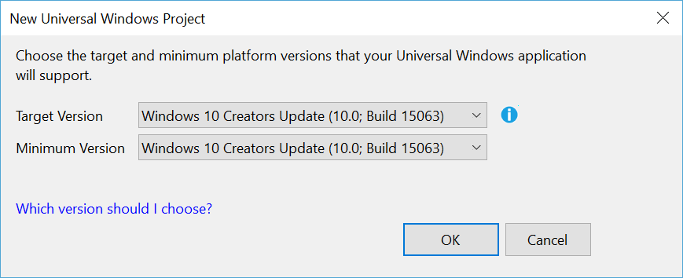
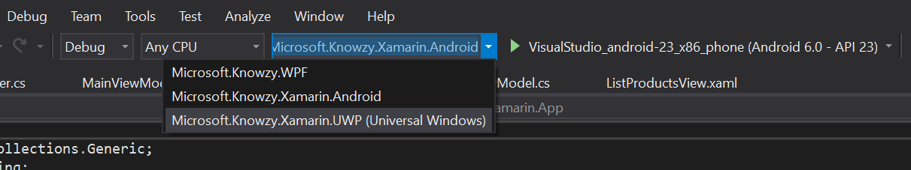
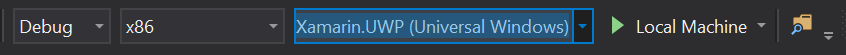
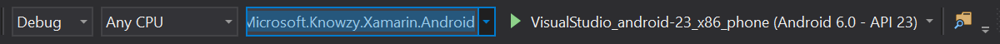
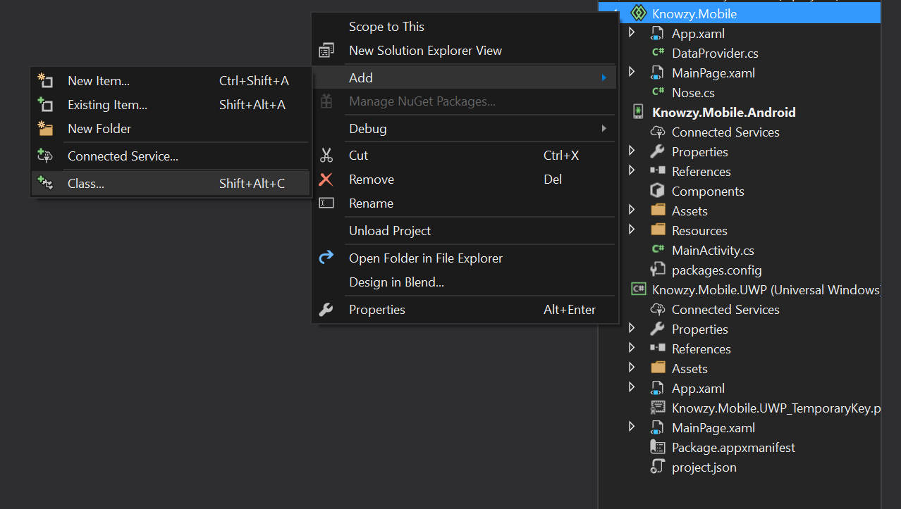
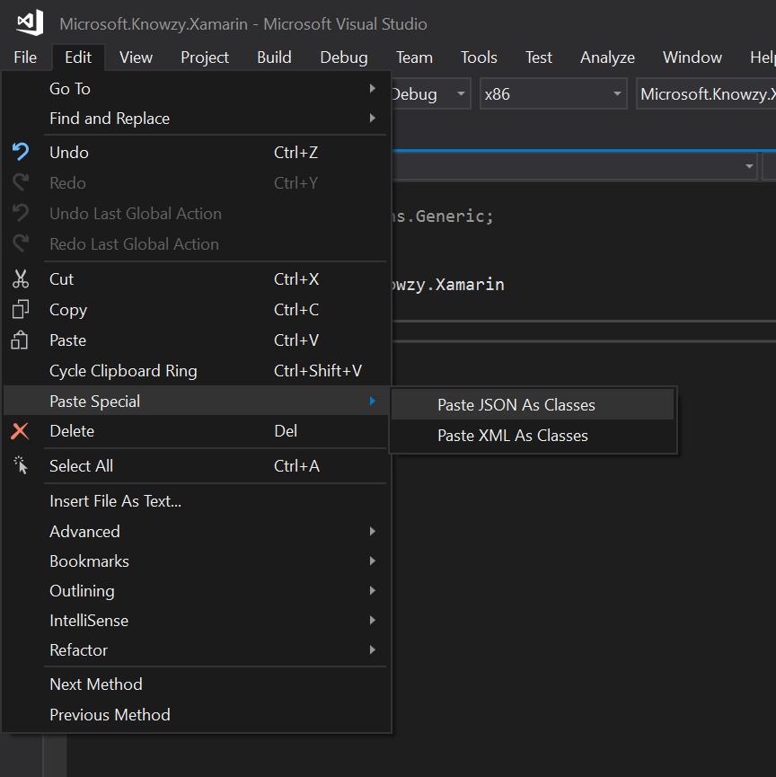
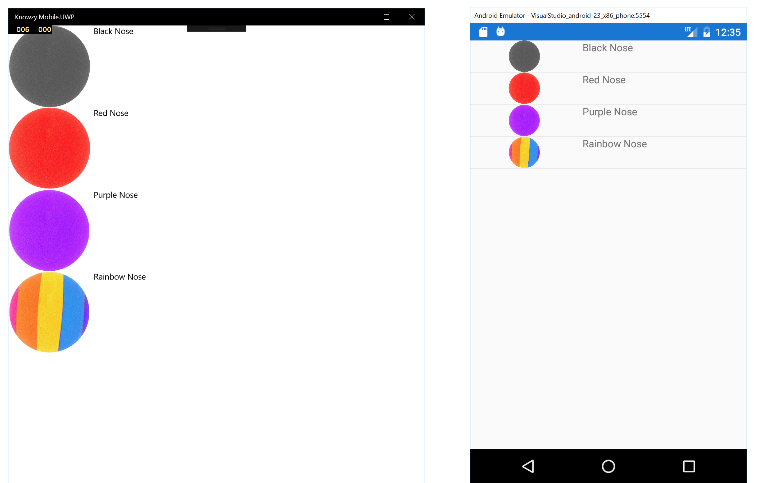

# Task 3.1.1 - Create a Xamarin.Forms app with shared UI

Building a cross platform mobile application will help our marketing department reach an even wider audience of potential customers. Xamarin.Forms allows us to build one application that reaches multiple platforms.

**Goals for this task:** Create a mobile application with Shared App that runs on Android and UWP.

This is going to be an entirely new product for Knowzy and we'll start from scratch. We've already done some investigation based on the requirements given to us by our management, and we've written a guide for the developer to help them get started.

## Prerequisites

This walkthrough assumes that you have:

* Windows 10 Creators Update
* Visual Studio 2017 with the following additional workloads:
    * Mobile Development with .NET
    * Universal Windows Platform development

[Click here](https://docs.microsoft.com/en-us/visualstudio/install/install-visual-studio) to learn how to install Visual Studio. If you already have Visual Studio 2017 but you're not sure if you have the right workloads installed, open the Visual Studio installer, and then select **Modify** to view your current workloads. Install any that are missing.

## Task

#### Start by creating a new Xamarin.Forms application

1. In Visual Studio, select **File -> New -> Project** from the taskbar.

2. Under **Templates -> Visual C# -> Cross-Platform** select *Cross Platform App (Xamarin.Forms or Native)*. Pick a name, and then create the project.
    > Note: pick a short name and place the project close to the root of your drive (ex: c:\source) in order to avoid long names that might cause issues later when running your project.

3. We'll start with a Blank App. Make sure Xamarin.Forms is selected under **UI Technology** and that Shared Project is selected under **Code Sharing Strategy**.

    

    > Note: A *Xamarin Mac Agent* window might open asking you to connect to a Mac as soon as you create the project. You can safely ignore the message and close this window.

    > Note: A *New Universal Windows Project* might open asking you to choose target and minimum platform version. Make sure **Target Version** is *Windows 10 Creators Update*. Minimum version can be anything.

    

That's it. At this point, you should probably spend some time checking out the new solution. You'll notice there are four projects in the solution, one shared project and three platform specific projects. To run the app on a specific platform, use the drop down menu near the top of Visual Studio to select which project you want to run:



We'll focus on UWP and Android for our first release. To run your app as a UWP app, select the UWP project. Then change the architecture (the drop down menu to the left of the Startup projects menu), and select x86 or x64. Then, click the play button (or press **F5**) to build and run the app:



To test and debug the app on Android, there are several options:

* [Use the Android SDK Emulator](https://developer.xamarin.com/guides/android/deployment,_testing,_and_metrics/debug-on-emulator/android-sdk-emulator/)

* [Use the Visual Studio Emulator](https://developer.xamarin.com/guides/android/deployment,_testing,_and_metrics/debug-on-emulator/visual-studio-android-emulator/)

* [Use a physical device](https://developer.xamarin.com/guides/android/deployment,_testing,_and_metrics/debug-on-device/)

> Note: If you try to run the faster x86 version of the Android SDK Emulator and get an exception, you might need to turn of the hypervisor by running the following command in Command Prompt as Administrator: ```bcdedit /set hypervisorlaunchtype off``` and reboot.

Change the Startup Project to the Android project, and use the drop down menu on the right to select the emulator or device that you want to use. Click the play icon to build and run the app.



Now get to know your new app.

> Note: Since we'll not be using the iOS project for this release, feel free to remove it from your solution.

#### Add shared Business Logic

For our first task, we want to be able to list all the different Knowzy products. Fortunately, we already have a public feed for our products. It's located  [here](https://raw.githubusercontent.com/Knowzy/KnowzyInternalApps/master/src/Noses/noses.json), and we can use it to get all of the data for our app.

1. Let's create a new class that we can use to represent our nose model. Right-click the Shared project (the one without a platform specifier at the end), and select **Add -> Class**.

    

    Name the new class **Nose**. Erase everything between the namespace definition. We need our new class to match the data that we get from our JSON feed, so we'll create a new class from the JSON. Copy this JSON but don't paste it anywhere yet:

        {
            "Id": "RN3454",
            "Name": "Black Nose",
            "RawMaterial": "Black foam",
            "Notes": "Everything you'd expect, and a little something more.",
            "Image": "https://raw.githubusercontent.com/Knowzy/KnowzyInternalApps/master/src/Noses/black.png"
        }

    In Visual Studio, place the cursor where you want to copy the new class (between the namespace braces). In the taskbar, select **Edit -> Paste Special -> Paste JSON as Classes**. This generates a new class for you by using the JSON that you just copied. You just need to change the name from RootObject to **Nose**.

    

2. Now that we have our model, let's create a way to retrieve the data from our feed.
    * First, we'll use Json.Net to deserialize the JSON, so we'll need to reference the Nuget package to both the UWP and the Android project. Right-click each project and select **Manage Nuget Packages**. Search for **Newtonsoft.Json** and then install it (make sure to switch to the **Browse** tab when searching).
    * Follow the same steps as above to create a new class in the shared project.
    * Name the new class **DataProvider**.
    * Make the class public.
    * Add this static method in the class to pull in the data from the link above:

            public static async Task<Nose[]> GetProducts()
            {
                using (var client = new HttpClient())
                {
                    var json = await client.GetStringAsync("https://raw.githubusercontent.com/Knowzy/KnowzyInternalApps/master/src/Noses/noses.json");

                    return JsonConvert.DeserializeObject<Nose[]>(json);
                }
            }

        You'll need to add few namespaces for this function to work:

            using Newtonsoft.Json;
            using System.Net.Http;
            using System.Threading.Tasks;

We now have a static method that retrieves the JSON feed and deserializes it into Nose objects, which we can use in our app.

#### Add shared UI

Now that we have the business logic out of the way, let's move on to the UI. Xamarin.Forms uses XAML to define the shared UI, so if you've used XAML before, you'll feel right at home. All the shared code is in the shared project of the solution, and there's already a XAML page created for us: MainPage.xaml. Go ahead and open the page. Currently there's only one element there, a [Label](https://developer.xamarin.com/guides/xamarin-forms/user-interface/text/label/). Instead of a Label, we'll use a [ListView](https://developer.xamarin.com/guides/xamarin-forms/user-interface/listview/) to display all of the products.

1. Remove the Label and add a ListView instead. Give it a name. In this case it's *ProductListView*.

        <ListView x:Name="ProductListView">

        </ListView>

2. Open MainPage.xaml.cs. This is where the underlying code for your app view goes. Here we can override the *OnAppearing* method which allows us to get the list of products, and set them as the source of the ListView. Add the following code to the class:

        protected async override void OnAppearing()
        {
            base.OnAppearing();
            ProductListView.ItemsSource = await DataProvider.GetProducts();
        }

3. Finally, we need to define what each product will look like. For that, we'll create a data template to customize each [Cell](https://developer.xamarin.com/guides/xamarin-forms/user-interface/listview/customizing-cell-appearance/). Here is the final XAML for the ListView:

        <ListView x:Name="ProductListView">
            <ListView.ItemTemplate>
                <DataTemplate>
                    <ViewCell>
                        <StackLayout Orientation="Horizontal">
                            <Image Source="{Binding Image}" HeightRequest="150" WidthRequest="150"></Image>
                            <Label Text="{Binding Name}"></Label>
                        </StackLayout>
                    </ViewCell>
                </DataTemplate>
            </ListView.ItemTemplate>
        </ListView>

**Task Complete**. Go ahead and try running the app on your machine, and then in the Android emulator.



[Go to the next Task](312_Camera.md) where you'll add another page and the capability to capture an image by using APIs specific to each platform.

## Resources

1. [Xamarin.Forms Quickstart](https://developer.xamarin.com/guides/xamarin-forms/getting-started/hello-xamarin-forms/quickstart/)
2. [Introduction to Xamarin.Forms](https://developer.xamarin.com/guides/xamarin-forms/getting-started/introduction-to-xamarin-forms/)
3. [Xamarin.Forms XAML documentation](https://developer.xamarin.com/guides/xamarin-forms/xaml/)

## continue to [next task >> ](312_Camera.md)

 
## The solution for this task is located [here](https://github.com/Knowzy/KnowzyAppsFinal/tree/master/stories/3/3.1.1) 
