# Task 4.1.1 - Create a shared CosmosDB to store all data

## 1. Pre-Requisites

* You should download and extract the [CosmosDB Data Migration Tool](https://www.microsoft.com/en-us/download/details.aspx?id=46436)
* You'll need a Microsoft Azure subscription for this task.

### a. Working with Cloud Shell

Azure Cloud Shell comes with the Azure CLI already configured. This makes setup straightforward. We'll be using Azure Cloud Shell throughout this guide, and we'll need to get Cloud Shell pointed toward the subscription we want to work with.

**NB: All shell instructions are based on using the Cloud Shell, using a local powershell, bash session or command prompt may cause unexpected results.**

i) Access Azure Cloud Shell using the `>_` Icon in the **top right corner** of the portal.

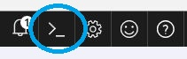

ii) Point to your Azure subscription

    If you have more than one subscription in your azure portal, it's a good idea to first check which one your CLI is pointed to.  The command for this is:

        az account show

    If it's not pointed to the subscription you want to use, you can re-point your CLI to the correct subscription using:

        az account set --subscription <SubscriptionId>

    You can list out all subscriptions you have access to using:

        az account list

### b. Create a resource group 

We need to create a resource-group to ring-fence all of our work, and we'll start out by storing a couple of variables we're going to use again in our shell. _(Note; many resources within Azure require a unique name, as such we recommend you use the guidelines in the published [naming conventions](https://docs.microsoft.com/en-us/azure/architecture/best-practices/naming-conventions))_

### c. First store the name you want to use for your resource group:
Resource group names must be globally unique within Azure, so make sure it's both memorable, and specific to you and your project.

    RESOURCE_GROUP=<unique name>


### d. Then supply the location we're going to create it in _(for our example you should pick from: 'eastus', 'westeurope' or 'southeastasia')_

    LOCATION=eastus

### e. Create our new resource group within our current subscription:
```bash 
    az group create --name $RESOURCE_GROUP --location $LOCATION
```

## 2. Create and initialise CosmosDB

### a. Store the name of our database:
Like resource group names, CosmosDB names must be globally unique within Azure, so again we should select something specific.

    COSMOSDB_NAME=<unique database name> _(names must be all lower case and no symbols)_

### b. Create the CosmosDB instance
We can now go ahead and use the Azure CLI within the Cloud Shell to create our CosmosDB Instance.

    az cosmosdb create -g $RESOURCE_GROUP -n $COSMOSDB_NAME --locations "EAST US2"=0

This command will take some time to complete. You'll know it succeeded when the Cloud Shell console outputs something like the below screen, containing the name you specified in step 1 above in the 'documentEndpoint':

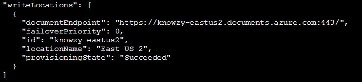

### c. Import data into collections
For this step we'll need to use the [CosmosDB Data Migration Tool](https://www.microsoft.com/en-us/download/details.aspx?id=46436) that you should have already downloaded and extracted.

We're going to perform the following steps for the 3 collections we need to add to Azure; Customers, Products and Orders. For convenience sake you can download a zip file containing all three: [Here](Reference/HackSchemas.zip).

i) Load up the UI version of the data migration tool by running 'dtui.exe'

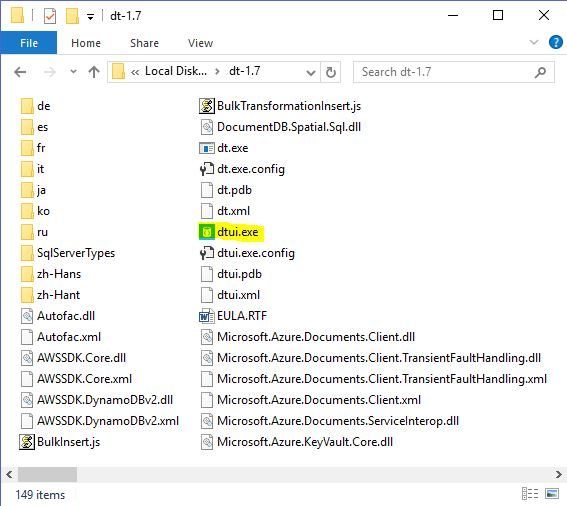

ii) You should be greeted with the following screen below, you can just click 'Next' for now.

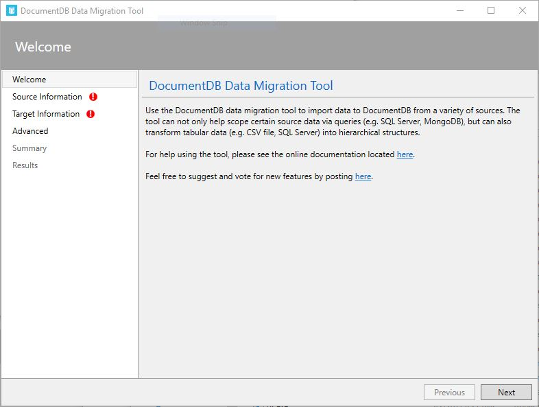

iii) This is the 'Source Information' screen where we specify the information source for our import. Select the JSON file for the collection you want to import (We'll use customers.json for our example) then click 'Next' to move on.

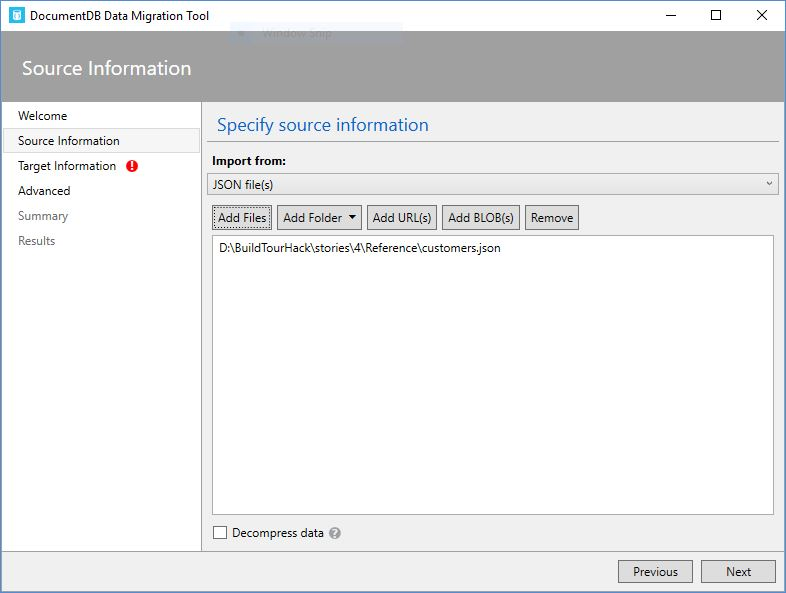

iv) You should now see a screen that looks like below named 'Target Information', where you specify information about the destination of our import. First set the 'Export to' option to: 'CosmosDB - Sequential record import (partitioned collection).

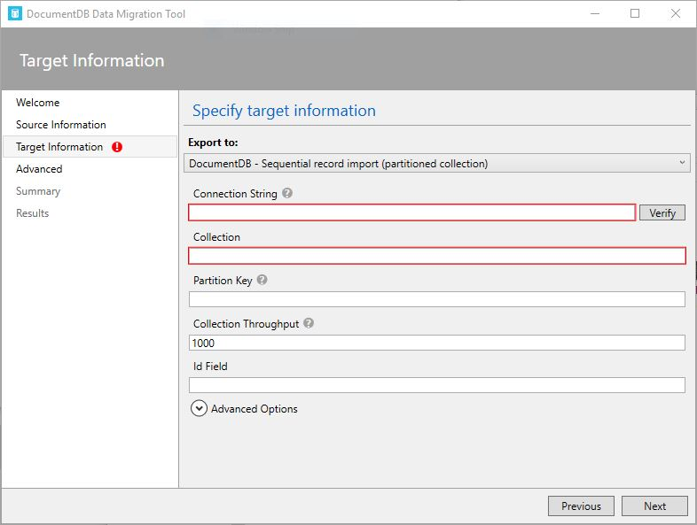

v) We'll need to retrieve our 'Connection String' from the Azure Portal. Open the portal, and select your CosmosDB Instance, click on 'Keys', select 'Read/Write Keys', and click the button next to 'PRIMARY CONNECTION STRING' to copy it to your clipboard.

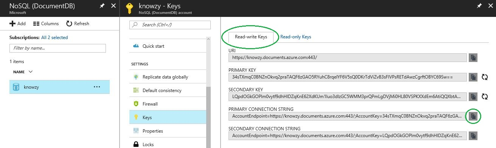

vi) Go back to the CosmosDB Data Migration Tool and paste the value into the box for the connection string. The importer also requires that you specify the database you'll be importing to, so add the following string with the name of your database (which you defined in step 2a) to the end of the connection string you just pasted:

    Database=<your CosmosDB name> 

You'll have something that looks like this:


v) Click the 'verify' button, and you should get confirmation that the importer can successfully connect to your CosmosDB. Which should look like this:

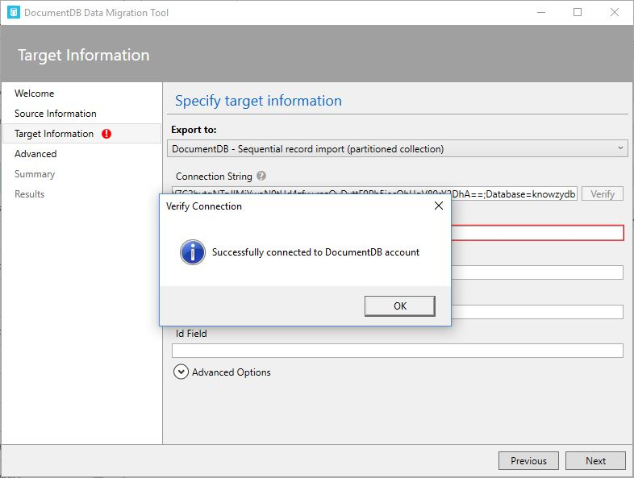

vi) Now we need to specify the other parameters for the new collection, complete the rest of the form as below:

* Collection: [name of collection] - _This is the name of the collection that will be created, you should choose from (orders, customers or products) dependent which import you are completing, we chose customers.json so our collection is 'customers'_>
* Partition Key: /[partition key] - _This is the partition key that will be applied to the collection, for customers and orders we do this for '/companyName' for products we use '/category', be careful of case sensitivity here!_
* Collection Throughput: 400 - _This is the preset throughput to configure the collection for, we want to keep costs down during dev, so we should change this from 1000 (the default) to 400.
* Id Field: id - _This is the ID field of the schema, for sake of simplicity we've made them all 'id' (case sensitive), but this is customisable in more advanced scenarios._

Once your form looks like below, we're ready to click 'Next'!

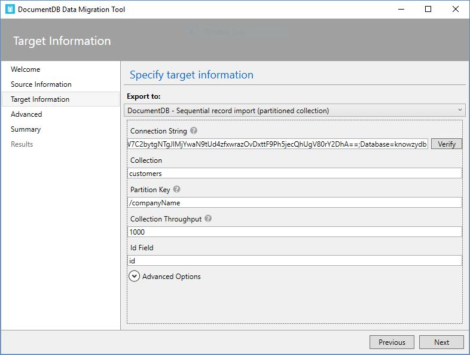

vii) Click 'Next' on the 'Advanced' settings screen. We want our errors to show in the tool UI so we don't need to specify anything here. Then you should see a screen that looks like this:


viii) Carefully review the import settings, and when you're satisfied click 'Import'. If the import fails, errors will be displayed in the UI. All being well, your import will succeed and you'll see a screen similar to this:

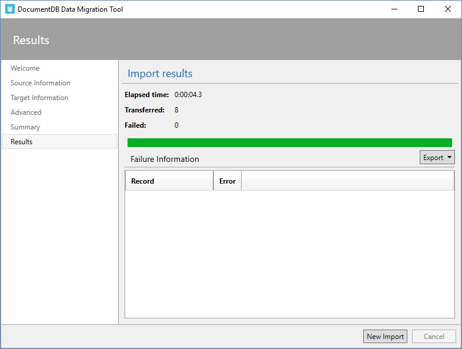

ix) You can now return to the portal, select your CosmosDB Instance, and click on 'Document Explorer' to explore your new schema.

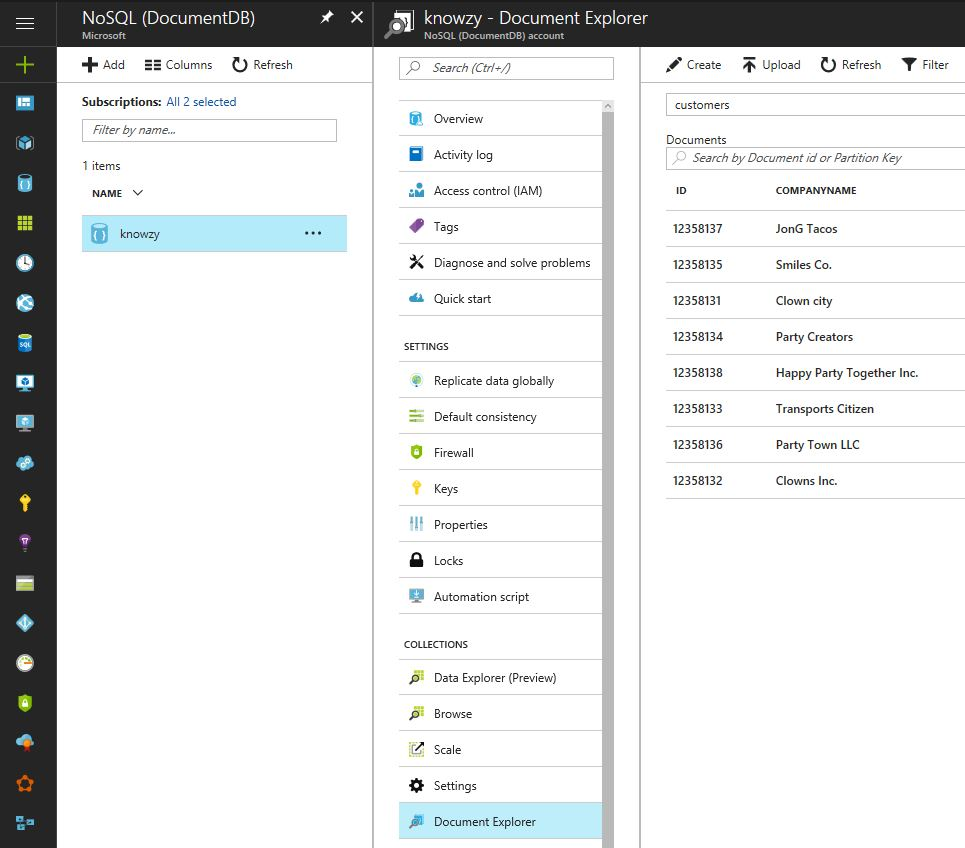

x) To import the other two collections (products and orders in our example given here), simply click 'New Import' and follow steps (ii) through (ix) using the next JSON file and schema Name for your chosen collection.

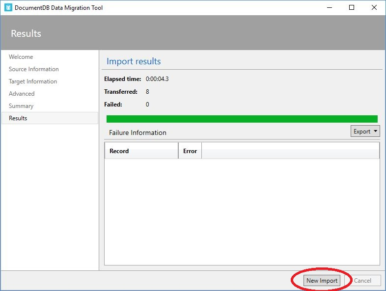


## 3. References
[CosmosDB Migration Tool Download](https://www.microsoft.com/en-us/download/details.aspx?id=46436)

## continue to [next task >> ](412_OrdersAPI.md)
