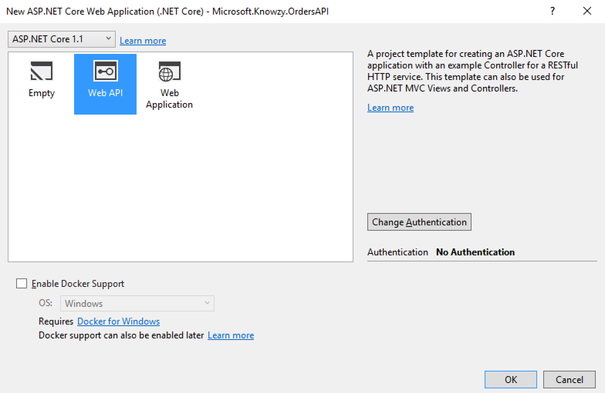
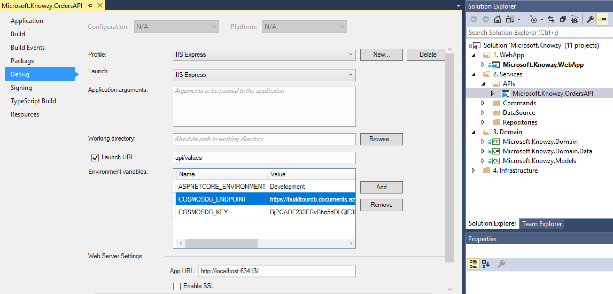

# Task 4.1.2 - Create API endpoint for shipping and receiving services

Now that you've created a database to store your data, it's time to create APIs to access that data.  Knowzy believes in a microservices based architecture so you'll need to start by creating a new API for orders so the Web app is not going directly to the database.
The end goal is a .NET Core based cross-platform solution. The architecture proposes a simplified microservice oriented architecture implementation with multiple autonomous microservices (each one owning its own data/db). The microservices will implement a simple CRUD approach using Http as the current communication protocol.

## Prerequisites 

* This task has a dependency on Tasks [1.1.1][111] and [4.1.1][411] and all of their prerequisites.
* [.NET Core SDK 1.1](https://www.microsoft.com/net/download/core)


## Creating a .NET Core App

### 1. Create a New WebAPI Project

From the command line or Windows Explorer create a new folder called `APIs` in the `src\2. Services` folder of the solution.

Open the `Microsoft.Knowzy` solution in Visual Studio 2017. Add a new solution folder called `APIs` to the `2. Services` folder. Create a new `ASP.NET Core Web Application` project called `Microsoft.Knowzy.OrdersAPI` in that folder:


Choose Web API for the project type, and leave the other options as they are (we will add Docker support later):



Note: you can also use [the dotnet cli to create a new .NET Core WebAPI project as documented here](https://docs.microsoft.com/en-us/aspnet/core/tutorials/web-api-vsc).

Let's test it out to make sure everything is working properly. In Visual Studio right click on the project and select `Debug -> Start New Instance`. Or you can use the terminal from the folder of this new project (`src\2. Services\APIs\Microsoft.Knowzy.OrdersAPI`) and use the `dotnet` cli as follows:

```bash
dotnet restore
dotnet run
``` 

If starting from Visual Studio it will start a browser window for you to see your app running. If starting from the command line, navigate to [http://localhost:5000/api/values](http://localhost:5000/api/values) to see your app running. You should see the result `["value1","value2"]` returned in the browser. Press `Ctrl+C` if you started in the terminal or click the `Stop` button in Visual Studio to stop the API app.

### 2. Add functionality

Let's make a small change to the API so that it responds to our inputs. Modify the code in `ValuesController.cs` in the `Controllers` folder with the following changes:

```diff
// GET api/values/5
[HttpGet("{id"})]
public string Get(int id)
{
-  return "value";
+  return $"The value is {id}";
}
```

Run the project from Visual Studio again or from the terminal run the project to see our changes:

```bash
dotnet run
```

This time, when you navigate to http://localhost:<Your API PORT>/api/values/5 you should see `The value is 5` returned.

### 3. Using Environment Variables and Connecting to CosmosDB

In a real-world app, you won't check your secrets into source control, and you won't be writing local code that connects directly to your production data store. Depending on your environment, you might not even have access to production. To address these issues and see how they tie in with Docker, we're going to use the `COSMOSDB_ENDPOINT` and `COSMOSDB_KEY` environment variables.

The default Web API template already calls `.AddEnvironmentVariables()` (look for it in `Startup.cs`), so we just need to set a variable, then access it in our code. 

If running from the terminal, to set a variable run the following in a command prompt with the primary connection string for your account:

```
export COSMOSDB_ENDPOINT=<your cosmosdb endpoint>
export COSMOSDB_KEY=<your cosmosdb account key>
```

If running from Visual Studio 2017, add these values to the Environment Variables section of the `Microsoft.Knowzy.OrdersAPI` project properties:



To use these environment variables in our code, we'll just pass the entire configuration object down to a new data access class.

In `Startup.cs`, make the following changes:

```diff
public void ConfigureServices(IServiceConnection services)
{
  // Add framework services.
  services.AddMvc();
+ services.AddSingleton<IConfiguration>(Configuration);
}
```

Now let's connect our solution to our data store in [CosmosDB](https://docs.microsoft.com/en-us/azure/cosmos-db/introduction) that was created as part of task [4.1.1][411]. 

Start by adding a Nuget package reference to the latest stable version of `Microsoft.Azure.DocumentDB.Core` to the `Microsoft.Knowzy.OrdersAPI` project.

Add a new folder called `Data` to the `Microsoft.Knowzy.OrdersAPI` project. This folder will have the classes that interact with your CosmosDB data store. 

Add a new interface called `IOrdersStore.cs` to the `Data` folder and populate it with the following:

```csharp
using System;
using System.Threading.Tasks;

namespace Microsoft.Knowzy.OrdersAPI.Data
{
    public interface IOrdersStore : IDisposable
    {
        Task<bool> Connected();
    }
}
```

Add a new class called `OrdersStore.cs` to the `Data` folder and populate it with a method to check if it can connect to CosmosDB. Make sure to update the database and collection name in this code to match yours:

```csharp
using System;
using System.Threading.Tasks;
using Microsoft.Extensions.Configuration;
using Microsoft.Azure.Documents.Client;

namespace Microsoft.Knowzy.OrdersAPI.Data
{
    public class OrdersStore : IOrdersStore
    {
        private readonly DocumentClient _client;
	    private Uri _ordersLink;
        public OrdersStore(IConfiguration config)
        {
            var EndpointUri = config["COSMOSDB_ENDPOINT"];
            var PrimaryKey = config["COSMOSDB_KEY"];
			 _client = new DocumentClient(new Uri(EndpointUri), PrimaryKey);
			 //Make sure the below values match your set up
			 _ordersLink = UriFactory.CreateDocumentCollectionUri("knowzydb", "orders"); 
        }

        public async Task<bool> Connected()
        {
            try
            {
                var db = await _client.GetDatabaseAccountAsync();
                return true;
            }
            catch
            {
                return false;
            }
        }

        private bool disposedValue = false; // To detect redundant calls
        protected virtual void Dispose(bool disposing)
        {
            if (!disposedValue)
            {
                if (disposing)
                {
                    _client.Dispose();
                }
                disposedValue = true;
            }
        }
        
        void IDisposable.Dispose()
        {
            Dispose(true);
        }
    }
}
```
Note how we are using the [ASP.NET Core dependency injection](https://docs.microsoft.com/en-us/aspnet/core/fundamentals/dependency-injection) to get the config instance passed into the class initializer for us, and with it we get the environment variable values. You can read more about configuration in ASP.NET Core in [this help article](https://docs.microsoft.com/en-us/aspnet/core/fundamentals/configuration).

Modify `Startup.cs` and register our data access with the list of services (IoC):

```diff
public void ConfigureServices(IServiceConnection services)
{
  // Add framework services.
  services.AddMvc();
  services.AddSingleton<IConfiguration>(Configuration);
+ services.AddSingleton<Data.IOrdersStore, Data.OrdersStore>();
}
```

To test it outupdate the `ValuesController.cs` file follows:

```diff
...
+ using Microsoft.Knowzy.OrdersAPI.Data;
...
   public class ValuesController : Controller
{
+        private IOrdersStore _ordersStore;
+        public ValuesController(IOrdersStore ordersStore)
+        {
+            _ordersStore = ordersStore;
+        }


...
    // GET api/values/5
    [HttpGet("{id}")]
-    public string Get(int id)
+    public async Task<string> Get(int id)
    {
-      return "value";
+      var status = await _ordersStore.Connected() ? "connected" : "not connected";
+      return $"We are {status} to CosmosDB! and your value is {id}";
    }
  }
```

If you now run the API app again and call `/api/values/5` on your API you should see `We are connected to CosmosDB! and your value is 5` returned.

### 4. Implement the Orders API

Now it's time to implement the endpoints for the Shipping and Receiving controllers of our Orders API, running the API app as needed to verify your app locally.

In the `Microsoft.Knowzy.OrdersAPI` add a project reference to the `Microsoft.Knowzy.Domain` project. This reference has the model classes we will use in the Orders API for serialization.

Edit the `IOrdersStore.cs` interface to add the GetShippings method:

```diff
...
+ using System.Collections.Generic;
...
    public interface IOrdersStore : IDisposable
    {
        Task<bool> Connected();

+        IEnumerable<Domain.Shipping> GetShippings();
    }
``` 
And edit the `OrdersStore.cs` class to implement that method to return all orders:

```diff
...
+ using System.Collections.Generic;
+ using System.Linq;
...
+        public IEnumerable<Domain.Shipping> GetShippings()
+        {
+            FeedOptions options = new FeedOptions();
+            options.EnableCrossPartitionQuery = true;
+
+           return _client.CreateDocumentQuery<Domain.Shipping>(
+               _ordersLink,
+               "SELECT * FROM orders o WHERE o.type='shipping'",
+               options).ToList();
+        }
```

Add a new class called `ShippingController.cs` to the `Controllers` folder to return all shipping orders in the Get method (choose to add a new class instead of a new Controller as we don't need the scaffolding from adding a Controller:

```csharp
using System;
using System.Collections.Generic;
using Microsoft.AspNetCore.Mvc;
using Microsoft.Knowzy.OrdersAPI.Data;

namespace Microsoft.Knowzy.OrdersAPI.Controllers
{
    [Route("api/[controller]")]
    public class ShippingController : Controller
    {
        private IOrdersStore _ordersStore;
        public ShippingController(IOrdersStore ordersStore)
        {
            _ordersStore = ordersStore;
        }
        // GET api/values
        [HttpGet]
        public IEnumerable<Domain.Shipping> Get()
        {
            return _ordersStore.GetShippings();
        }
    }
}
```

Now, when you run and browse your API to `/api/Shipping` you should get back the json array with all the shipping orders in the CosmosDB `orders` collection.

You now need to finalize the Orders API. This is the full `IOrderStore.cs` interface:
```csharp
using System;
using System.Threading.Tasks;
using System.Collections.Generic;
using Microsoft.Knowzy.Domain;

namespace Microsoft.Knowzy.OrdersAPI.Data
{
    public interface IOrdersStore : IDisposable
    {
        Task<bool> Connected();
        IEnumerable<Shipping> GetShippings();
        Shipping GetShipping(string orderId);
        IEnumerable<Receiving> GetReceivings();
        Receiving GetReceiving(string orderId);
        Task<Order> UpsertAsync(Domain.Order order);
        Task DeleteOrderAsync(string orderId);
        IEnumerable<PostalCarrier> GetPostalCarriers();
    }
}
```
Note that CosmosDB [supports parameterized SQL queries](https://azure.microsoft.com/en-us/blog/announcing-sql-parameterization-in-documentdb/) to avoid SQL injection.

Update `OrdersStore.cs` to implement the rest of the interface. This should be all you need to implement the rest of the Shipping controller and create the Receiving and PostalCarrier controllers.

Update `ShippingController.cs` to use your updated Orders Store class with Get(id), Put, Post and Delete methods. Use [this guide](https://docs.microsoft.com/en-us/aspnet/core/tutorials/first-web-api) to help. 

Create a new controller called `ReceivingController.cs` to handle all the CRUD methods for Receiving. Note that this can share most of of the same `OrderStore.cs` methods you used for Shipping (both Shipping and Receiving domain classes implement the Order domain class).

Create a new controller called `PostalCarrierController.cs` to handle just the Get (read all) method for it. You can find the PostalCarriers inside the orders collection in CosmosDB. 

### 5. Package for release

Now that we've got a working API app, let's package up all of our required files into a single folder for easy distribution. This time, we'll specify the Release configuration. 


Or from Visual Studio 2017, change the configuration to `Release`, right click on the API project, select `Publish`, and choose `Folder` as the destination.

Or in a terminal, run:

```bash
dotnet publish -c Release
```


By default, this places your app files in a folder named `bin/Release/PublishOutput` (Visual Studio) or `/bin/Release/netcoreapp1.1/publish` (terminal). We'll use this output path in [Step 4.1.4][414] when we build a Docker image for our app.

## 6. References

* [Troubleshooting guide](499_Troubleshooting.md)
* [.NET Core CLI reference](https://docs.microsoft.com/en-us/dotnet/articles/core/tools/)
* [Introduction to ASP.NET Core](https://docs.microsoft.com/en-us/aspnet/core/)
* [Configuration in .NET Core](https://docs.microsoft.com/en-us/aspnet/core/fundamentals/configuration)
* [Azure Cosmos DB: Getting started with the CosmosDB API and .NET Core](https://docs.microsoft.com/en-us/azure/CosmosDB/CosmosDB-dotnetcore-get-started)
* [eShopOnContainers sample reference microservice and container based application](https://github.com/dotnet-architecture/eShopOnContainers)

[411]: /stories/4/411_CosmosDB.md
[414]: /stories/4/414_Docker.md
[111]: /stories/1/111_BuildWebApp.md
