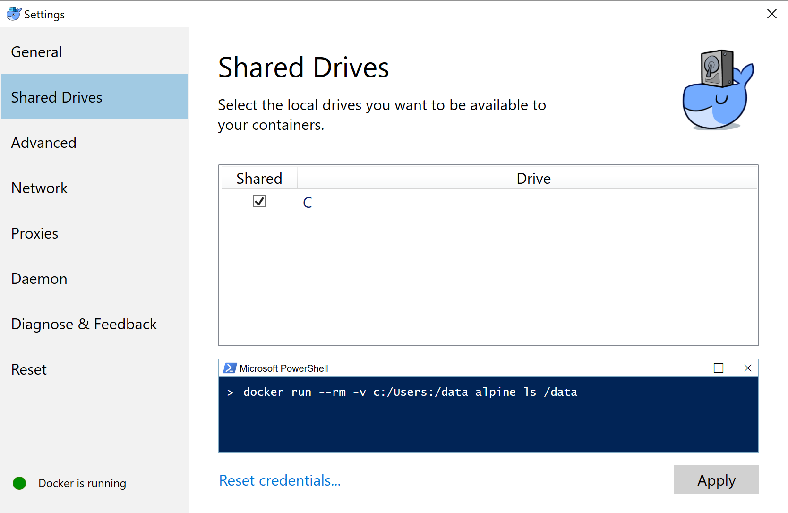
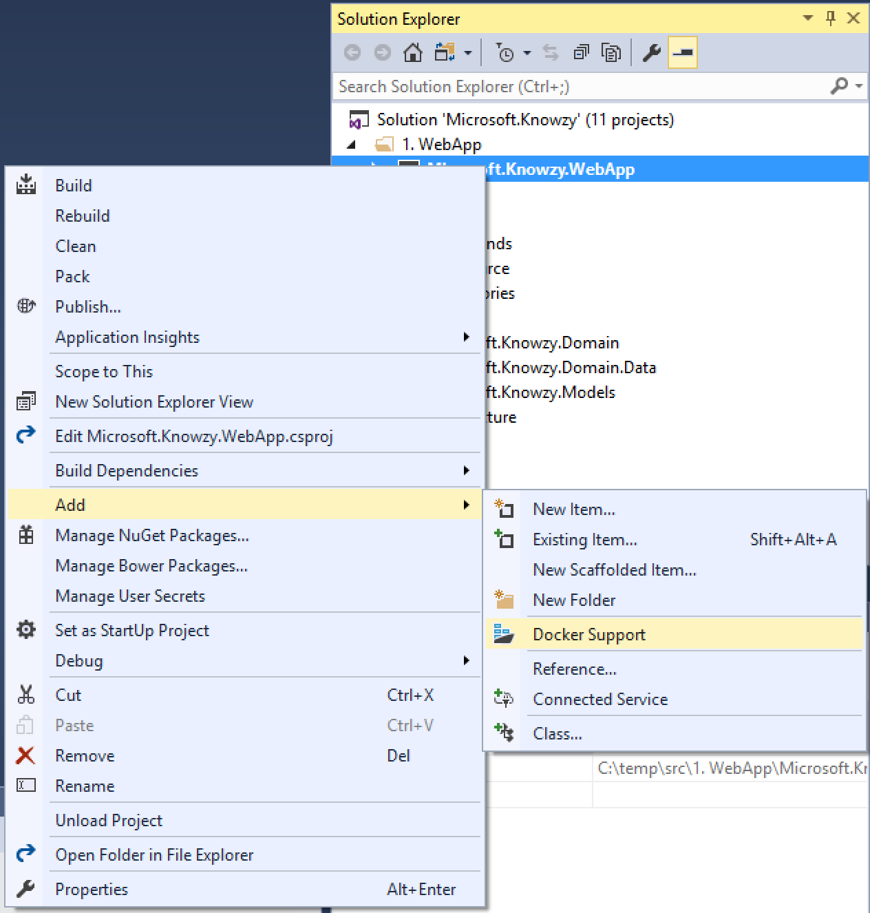
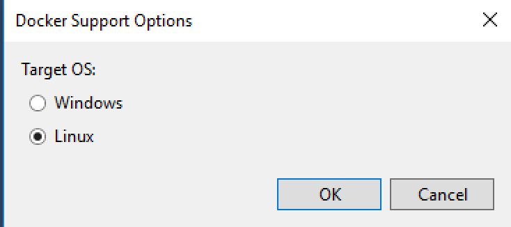

# Task 4.1.4 - Create Docker images

## 1. Prerequisites 

* [Docker for Windows](https://docs.docker.com/docker-for-windows/install/) (Stable channel)

### a. Configuring Docker for Windows

On Windows, you'll need to share your drive with Docker in order to build images.

i) Open up Docker settings by right-clicking the Docker icon in the taskbar, and choosing Settings.

ii) Go to the `Shared Drives` tab and share the C drive 



If you receive a firewall error, try these [Troubleshooting](499_Troubleshooting.md) steps. 

## 2. Building Images


If you have Visual Studio 2017 you can have it create Docker files for you by doing the following:
* Right click on the Microsoft.Knowzy.WebApp project, select `Add -> Docker Support`. If you are on prompted for Target OS, choose `Linux` and click OK.




This will create a Dockerfile file in your WebApp project, and add a new docker-compose project type to your solution.

* Use the same instructions and add Docker Support to the Microsoft.Knowzy.OrdersAPI project 
* Use the same instructions and add Docker Support to the Microsoft.Knowzy.ProductsAPI project

In the end you should have Dockerfile in each of those three projects, and all three referenced in your Docker compose project. 

Now under the `docker-compose.yml` file, find the `docker-compose.override.yml` file, and modify it with the following (changing the values of your CosmosDB endpoint and key):
```yaml
version: '3'

services:
  microsoft.knowzy.webapp:
    environment:
     - ASPNETCORE_ENVIRONMENT=Development
     - ASPNETCORE_URLS=http://0.0.0.0:5101
     - ORDERSAPI_URL=http://microsoft.knowzy.ordersapi:5102
     - PRODUCTSAPI_URL=http://microsoft.knowzy.productsapi:5103
    ports:
      - "5101:5101"

  microsoft.knowzy.ordersapi:
    environment:
      - ASPNETCORE_ENVIRONMENT=Development
      - ASPNETCORE_URLS=http://0.0.0.0:5102
      - COSMOSDB_ENDPOINT=<**YOUR COSMOSDB ENDPOINT**>
      - COSMOSDB_KEY=<**YOUR KEY**>
    ports:
      - "5102:5102"

  microsoft.knowzy.productsapi:
    environment:
      - ASPNETCORE_ENVIRONMENT=Development
      - ASPNETCORE_URLS=http://0.0.0.0:5103
      - COSMOSDB_ENDPOINT=<**YOUR COSMOSDB ENDPOINT**>
      - COSMOSDB_KEY=<**YOUR KEY**>
    ports:
      - "5103:5103"
```

You can now start debugging the Docker Compose project; it will create all three Docker images and run them on your local dev environment.


### Dockerfile Reference

If you're new to Docker, here's a quick overview of the Dockerfile for the Orders API, with an explanation for each statement

```Dockerfile
# Use the aspnetcore image as a base
FROM microsoft/aspnetcore:1.1

# Create a variable called source that has the path of the publish directory
ARG source

# Use /app inside the created container to hold our files
WORKDIR /app

# Expose port 80 from our created container. This gets overwritten by the docker compose override file
EXPOSE 80

# Copy from files in the source folder (or obj/Docker/publish if source was not set) into the current folder (/app). 
COPY ${source:-obj/Docker/publish} .

# The entrypoint for the container is the command: dotnet Microsoft.Knowzy.OrdersAPI.dll
ENTRYPOINT ["dotnet", "Microsoft.Knowzy.OrdersAPI.dll"]
```

> Note how we are using `dotnet` and the kestrel web server in the configuration to host the APIs and the Web App in their containers. For more information on hosting ASP.NET Core in production see this [article](https://docs.microsoft.com/en-us/aspnet/core/fundamentals/servers/).

### docker-compose.yml Reference

And an overview of what's going on in the docker-compose file

```yaml
version: '3'

services:

  # Defines a service and gives it a name
  microsoft.knowzy.webapp:

    # The image tag (in Docker, tags are used as version numbers)
    image: microsoft.knowzy.webapp
    
    # Tell Docker to build a new image
    build:
      # Specify the location of the Dockerfile used to build the image
      context: ./src/1. WebApp/Microsoft.Knowzy.WebApp
      dockerfile: Dockerfile

...
```

## 3. Interacting with Docker via PowerShell

You've run your apps by debugging the docker-compose project in Visual Studio. Before you can push your images out to the world, you'll need to know a few things about interacting with Docker. Open up a PowerShell session in the `Knowzy_Shipping_WebApp` folder

```powershell
# List your running containers
docker ps
```

```
CONTAINER ID        IMAGE                          COMMAND               CREATED             STATUS              PORTS                            NAMES
b0ee3710499e        microsoft.knowzy.webapp        "tail -f /dev/null"   2 minutes ago       Up 2 minutes        80/tcp, 0.0.0.0:5101->5101/tcp   dockercompose9124822939927181477_microsoft.knowzy.webapp_1
82a53378a7c6        microsoft.knowzy.ordersapi     "tail -f /dev/null"   2 minutes ago       Up 2 minutes        80/tcp, 0.0.0.0:5102->5102/tcp   dockercompose9124822939927181477_microsoft.knowzy.ordersapi_1
88b91969038c        microsoft.knowzy.productsapi   "tail -f /dev/null"   2 minutes ago       Up 2 minutes        80/tcp, 0.0.0.0:5103->5103/tcp   dockercompose9124822939927181477_microsoft.knowzy.productsapi_1
```

You'll see that Visual Studio and Docker have generated 3 images, started 3 containers, and have grouped them all together with the same name prefix, in this case, `dockercompose9124822939927181477`.

Since you've mapped host ports to containers, you're now able to interact with each of them on localhost by navigating to these urls:

* Orders API - [http://localhost:5102/api/values/5](http://localhost:5102/api/values/5)
* Products API - [http://localhost:5103/api/values/5](http://localhost:5103/api/values/5)
* Web App - [http://localhost:5101](http://localhost:5101)

Docker containers come and go frequently. You may want to practice and stop your currently running containers to free up some computing resources. In your PowerShell window, run the following, using your name prefix, which was displayed by `docker ps`. 

```powershell
# Remove resources for your named project
docker-compose -p <YOUR_NAME_PREFIX> down
```

If you want to spin up your containers again, you can debug the docker-compose project in Visual Studio, or interact directly via PowerShell by running the following commands:

```powershell
# Create and start containers
# -f: Use the compose & override files
# -d: Detach (Run containers in the background)
# --build: Build images before starting containers
docker-compose -f "docker-compose.yml" -f "docker-compose.override.yml" up -d --build

# Remove containers. 
# Because we used the defaults, so we don't have to specify a project name
docker-compose down
```

Note that you don't have to use Docker Compose to run your containers. You could do it all using just the `docker` command to create / start / remove the containers, but higher level tooling can greatly increase your productivity.

After you're done interacting with your containers, run the following to look at the images that you've built

```powershell
docker image ls 
```

````
REPOSITORY                                                     TAG                 IMAGE ID            CREATED             SIZE
microsoft.knowzy.productsapi                                   latest              0cf302713f5a        12 minutes ago      325 MB
microsoft.knowzy.webapp                                        latest              a26d42ad4ecd        12 minutes ago      337 MB
microsoft.knowzy.ordersapi                                     latest              f48275db75b4        12 minutes ago      325 MB
````

## 4. Deploying to a Docker Registry

So far, you've developed a few applications, packaged them in Docker images, and have tested them in a production-like environment by running them inside a container on your local computer. To get your apps running in the cloud, your next step is to push your images to a Docker registry.

You can use [Azure Container Registry](https://docs.microsoft.com/en-us/azure/container-registry/container-registry-intro) to hold your images. There are a few reasons to do this. First, you want to make sure our images aren't available to just anyone on the Internet. You want to be able to control access to your images! You will also want your images to be available in the same region as your compute resources for quick deployments.

### <a id="acr"></a> a. Create an Azure Container Registry in Azure Cloud Shell

Using the Azure Cloud Shell, set up some variables for your registry. These will be specific to you:

```bash
# Create some variables using Azure Cloud Shell
RESOURCE_GROUP=myResourceGroup
ACR_NAME=buildtourregistry
```

> If your resource group hasn't been created yet, the following command will create one in the East US region: `az group create -n $RESOURCE_GROUP -l eastus`

Next, use an Azure CLI command to create your container registry. 

Note the use of the `--admin-enabled` switch, which enables a simple username/password logon. In a production environment, you'll likely want to disable this option and create a Service Principal, but this will get us up and running for now.

```bash
az acr create --resource-group $RESOURCE_GROUP --name $ACR_NAME --sku Basic --admin-enabled
```

You're all set up with a registry, with the full name of `$ACR_NAME.azurecr.io`.

Execute the following command to get the admin password for your newly created registry:

```bash
az acr credential show -n $ACR_NAME -g $RESOURCE_GROUP
```

### b. Connect to Your Registry with PowerShell

Go back to your PowerShell window and login to your registry so we can push some images. Run the following command, using either the `password` or `password2` result from the previous command as your password:

```powershell
# Set up PowerShell variables to match those used in the Cloud Shell
# Again - these will be specific to you
$ACR_NAME = "buildtourregistry"

docker login -u $ACR_NAME -p <your password> "$ACR_NAME.azurecr.io"
```

> If you're having trouble copy/pasting the password from the Azure Cloud Shell to PowerShell, try highlighting your password and making sure your cursor is over the highlighted text, and then right click.

### c. Push an Image

You've already got some tagged images, and now you need to tell Docker that they're associated with your newly created registry. You'll specify the `knowzy` namespace before pushing them to keep these apps grouped together. This is as simple as adding another tag for our existing images, using the following commands.

```powershell
# Add additional tags to the existing images
docker tag microsoft.knowzy.ordersapi "$ACR_NAME.azurecr.io/knowzy/ordersapi:1"
docker tag microsoft.knowzy.productsapi "$ACR_NAME.azurecr.io/knowzy/productsapi:1"
docker tag microsoft.knowzy.webapp "$ACR_NAME.azurecr.io/knowzy/webapp:1"

# View the new tags. Notice there are multiple tags for the same image id
docker image ls
```

To push images to your registry, use the following commands:

```powershell
# The first push will take a moment
docker push "$ACR_NAME.azurecr.io/knowzy/ordersapi:1"

# The subsequent images will be much faster because they use a common base image
docker push "$ACR_NAME.azurecr.io/knowzy/productsapi:1"
docker push "$ACR_NAME.azurecr.io/knowzy/webapp:1"
```

When finished, you can look at your images in your Azure Container Registry by using the following commands in the Azure Cloud Shell:

```bash
# Use the Cloud Shell to inspect your registry
az acr repository list -n $ACR_NAME
az acr repository show-tags -n $ACR_NAME --repository knowzy/ordersapi
```

## 4. References

* [Troubleshooting guide](499_Troubleshooting.md)
* [Dockerfile reference](https://docs.docker.com/engine/reference/builder/)
* [Docker CLI reference](https://docs.docker.com/engine/reference/commandline/cli/)
* [Azure CLI reference](https://docs.microsoft.com/en-us/cli/azure/get-started-with-azure-cli)
* [Azure Container Registry reference](https://docs.microsoft.com/en-us/azure/container-registry/container-registry-intro)

## continue to [next task >> ](415_Kubernetes.md)