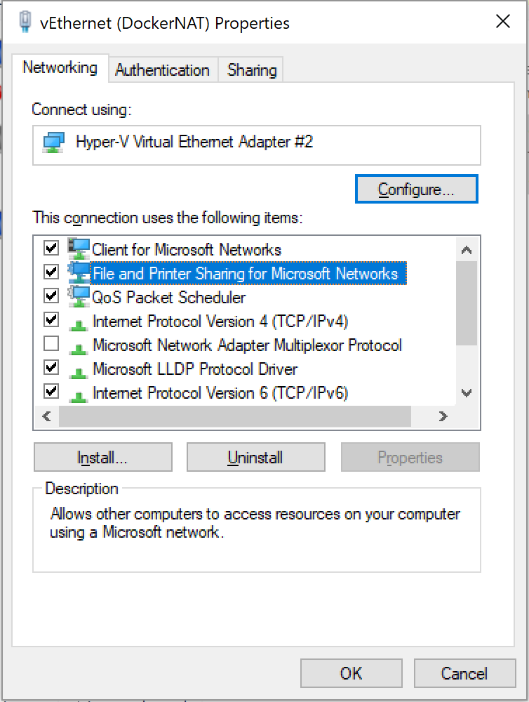

# Task 4 Troubleshooting Guide

## "Firewall detected" when sharing drive

If you encounter a firewall error when sharing drives with Docker, you may need to reset Windows File and Printer sharing on your Hyper-V virtual switch.

1. Right click your network connection in the taskbar, and choose **Network and Sharing Center**
2. In the left menu, select **Change Adapter Settings**
3. Right click and open the properties for the "vEthernet (DockerNAT)" adapter
4. Uncheck the box for **File and Printer Sharing for Windows** and hit OK

5. Open the properties again, re-enable **File and Printer Sharing for Windows** and hit OK
6. You should now be able to share drives with Docker

## Case sensitivity

If you're using Windows to follow along, it's important to note that we're using Linux containers on Docker.
This means that if you have a case mismatch between file/folder names, you may encounter errors when building or
running containers because Linux uses a case-sensitive file system.

For example, this could happen if you named your folder `ordersApi`, which by default will produce a dll with
the path `ordersApi/bin/Release/netcoreapp1.1/publish/ordersApi.dll`. When the supplied `Dockerfile` is
executed inside `ordersApi`, everything looks great! But when you run the container, it will fail because
the `ENTRYPOINT` is specified to look for `ordersapi.dll`