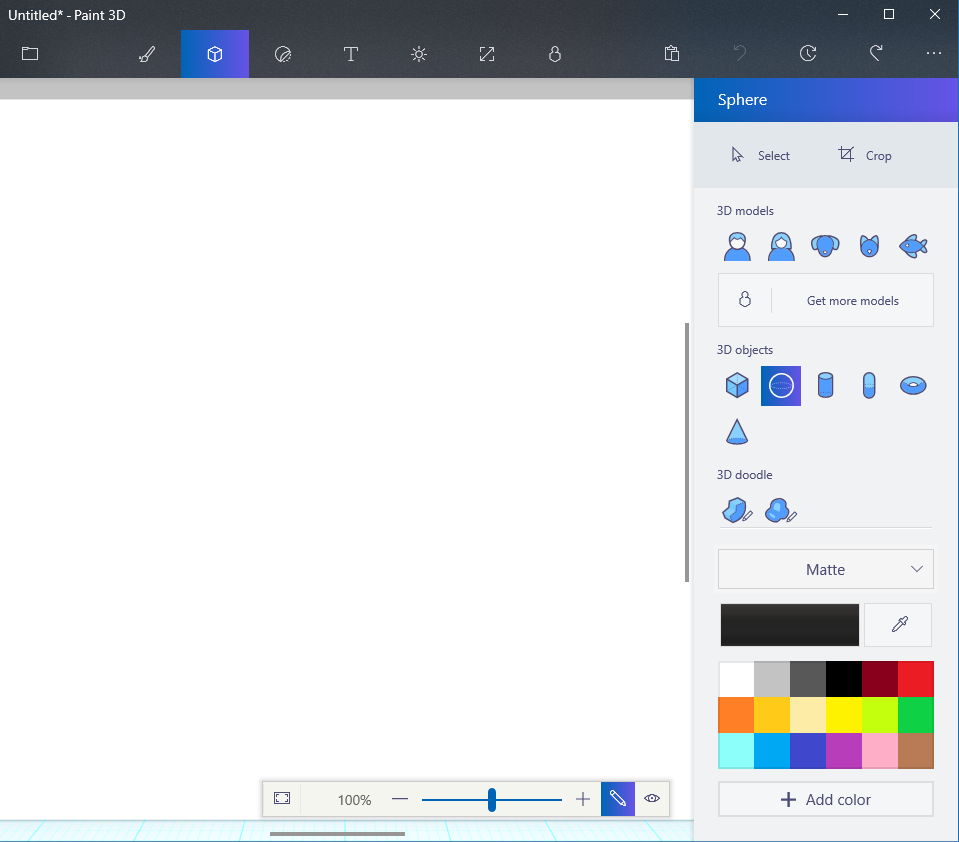
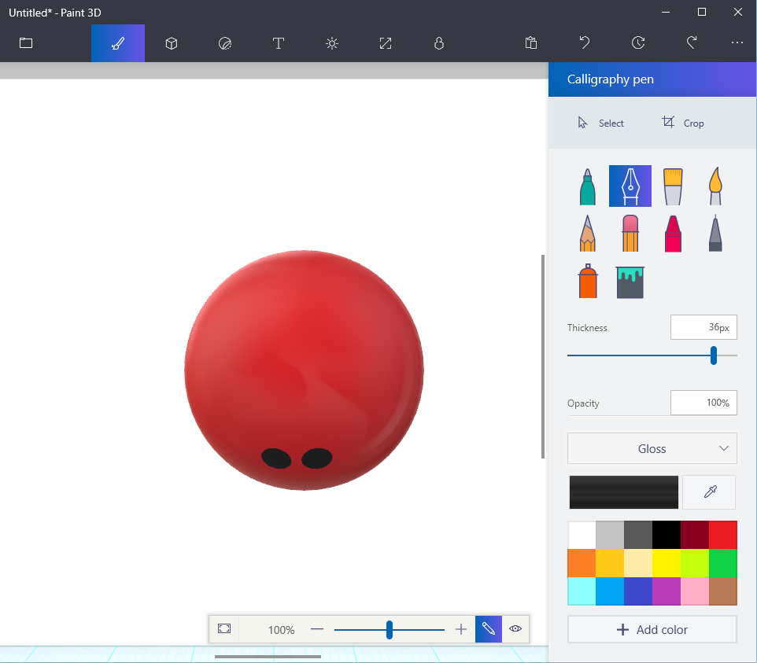
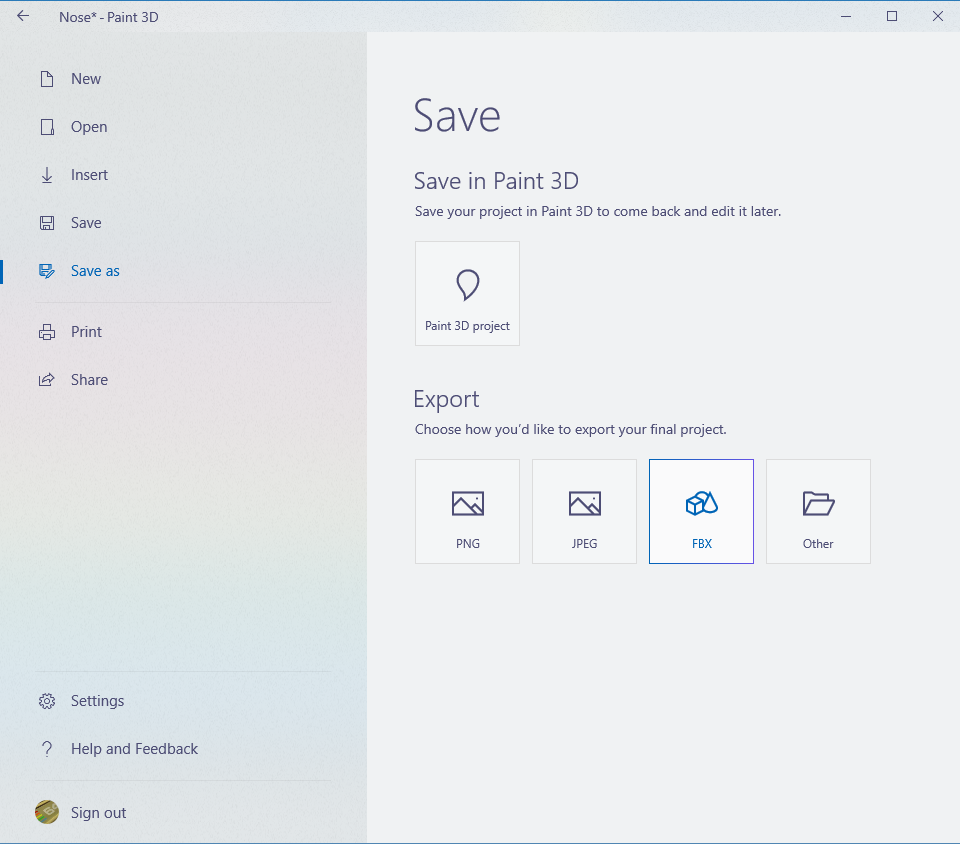

# Task 5.1.1 - Create the model in Paint3D

Creating 3D models of our products opens up a world of opportunities. We can 3D print prototype noses, render them in 3D to see how they look, and even view them in Virtual Reality!

3D Paint is a simple tool available in the Windows 10 Creators Update that allows us to create and paint 3D models. Perfect for this task!

## Prerequisites

This walkthrough assumes that you have:

* Windows 10 Creators Update
* Paint 3D

## Task

### Create the basic 3D nose model

First we will create the nose 3D model with a base color.

1. From the Windows Start menu, launch **Paint 3D**. If the **Welcome** screen is displayed, Click **New**.
2. You will see a blank white canvas where you will create your Knowzy nose prototype.
3. The menu at the top of the screen is where you select the tools you want to use. The brush icon (Art Tools) is for painting and coloring. The cube icon (3d objects) is for creating 3D objects. Click the cube icon to open the 3d objects menu. Ensure that the sphere in the 3D objects collection is selected:
    
4. Use the color palette to choose a color for the nose. You can click on the materials dropdown above the color palette to get different effects. For example, select **Gloss** to make the nose shiny. Play with the colors and materials options to get the color you want.
5. Draw a sphere on the canvas by placing the mouse pointer on the canvas. Press and hold the left mouse button while dragging the mouse until the sphere is the size you want. You can force the shape to be a circle by holding **Shift** down while dragging the mouse. This is how our first prototype looked:
    

### Add details to the nose

The second task is to add details to the nose. You can use stickers, color variations and drawings.
1. On the menu at the top of the screen, click the brush icon (Art tools) to see the tools available for drawing.
> Note: For these steps, it is important not to draw outside of the model on the white canvas because it will become part of the 3D model.

2. Use any of the art tools to draw on the model. Be creative! For our first prototype, we used the Calligraphy pen with the **Thickness** set to 36px to draw nostrils.

    

3. The Stickers menu (third icon from the left on the main menu) allows you to place stickers on the model. Feel free to play around with the various tools.

### Save and Export the model.

The last task is to save the model and export it to the Filmbox (FBX) format so we can use the model in Unity or BabylonJS. (For BabylonJS, we will convert it from .FBX to .OBJ. We will handle that in a future task.)

1. Click the Folder icon located at the top-left corner of the Paint3d window to open the **Save** menu. Under **Save in Paint 3D**, click **Paint 3d Project**, provide a name, and press **Enter** to save the model.
2. Back in the Paint3D editor, click the folder icon to open the **Save** menu again. Under **Export**, click **FBX**:

    

3. The **Save As** dialog appears. Save the FBX file in a location you can remember for the tasks ahead.

Congratulations, you now have a 3d Nose model that we can use in Unity or BablyonJS!

## References
Our first Nose Prototype:
[Nose Prototype (FBX)](./Reference/NosePrototype.fbx)

## Continue to the [next task >> ](512a_Unity.md)
