# Task 5.1.2a - Create a Unity solution to visualize 3D Model
Now that we have a 3D model of a nose, we can render it in real-time in a UWP app. To create the app, we will use the Unity 3D rendering engine.
Unity 3D has built-in support for loading Filmbox (FBX) files. We just need to load the model, add it to a scene, and export it as a UWP. This will allow us to simulate how our prototypes looks in the real world!

## Prerequisites

This walkthrough assumes that you have:

* Windows 10 Creators Update
* 3D Nose Model from Paint 5.1.1
* Unity 5.6 and the UWP Plugin for exporting a Unity project to a UWP app

## Task

### Create a new project

1. From the Windows Start menu, launch Unity. When the Project dialog appears, click the **New** icon.
    > Note: If you are launching Unity for the first time, log in with your free unity3d account.

2. In the New Project dialog, give the project a name, click **3D**, and specify a location for your project. Then click **Create Project**.

    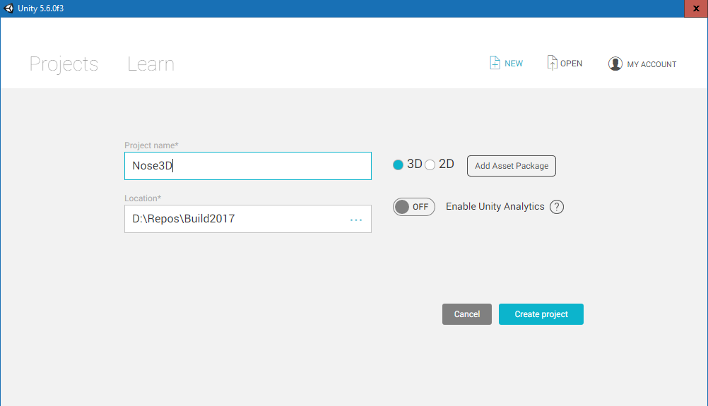

3. When the Unity designer appears, press **CTRL+S** to save the empty scene. The **Save Scene** dialog appears. Name the file **Main.unity** and save it in the **Assets** folder that  should be selected by default (the path appears in the top of the dialog).

**The interface**

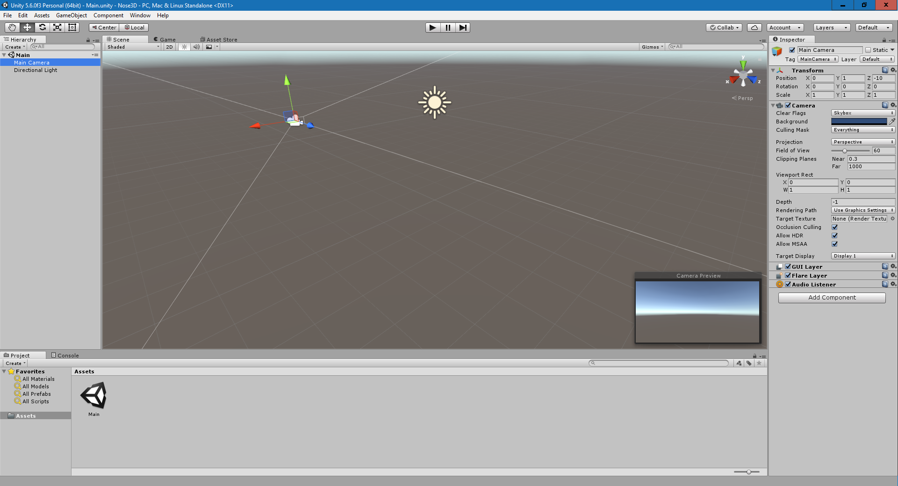

The Unity interface has five main areas. The 3D view in the center is your scene. Above the 3D view is a **Scene** tab and a **Game** tab. The **Scene** tab is where you will be working. The **Game** tab is where you will preview the scene when you click the play icon at the top.

The **Hierarchy** pane, on the left, lists the objects in your scene. If the **Main** scene is collapsed, click the chevron to expand the tree-view control. By default, the scene has a **Main Camera** (your point-of-view when you preview the scene in the **Game** tab), and a **Directional Light** (think of this as the sun).
This is where we will be adding our own objects to build up the scene. Each of these items is a GameObject.

The **Project** tab, at the bottom, displays the project file structure. Everything you work with needs to be in the default **Assets** folder.

The **Inspector** tab displays the properties of the selected GameObject. GameObjects in unity are composed of properties and components. For example, if you select the **Main Camera** from the Hierarchy window, you will see its properties and components.

### Load the 3D Nose model

Let's load the 3D Nose model that you created earlier in Paint 3D into Unity.

1. Click the **Project** tab in the bottom pane. Within the **Assets** pane, right-click and select **Create > Folder**. Name the folder **Models**.

    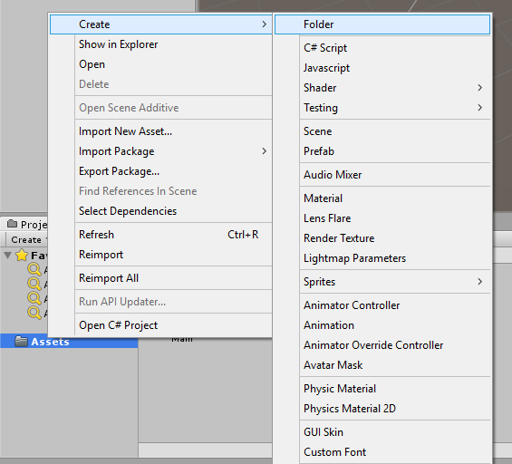

2. Using File Explorer, Locate the NosePrototype FBX model that you exported from Paint 3D in step 5.1.1, and copy it into the new **Models** folder (you can drag-and-drop from File Explorer onto the **Models** folder).
3. Open the **Models** folder in the **Project** pane. You should see the NosePrototype FBX file in the Assets/Models folder:

    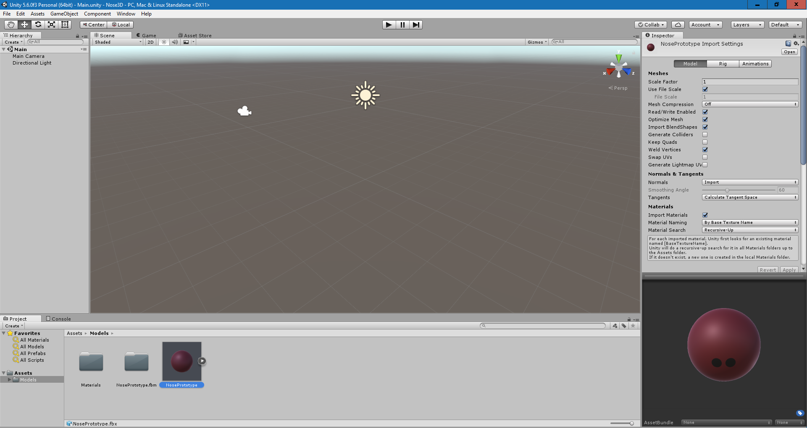

4. Drag **NosePrototype** from the **Models** folder to the **Hierarchy** window. You should see the nose in the **Hierarchy** view, but it may not be visible in the **Scene** view.
5. To make the nose visible in the **Scene** view, click on **NosePrototype** in the hierarchy view, hover the mouse over the **Scene** view, and press **F** on the keyboard to focus on the object. It should now be visible:

    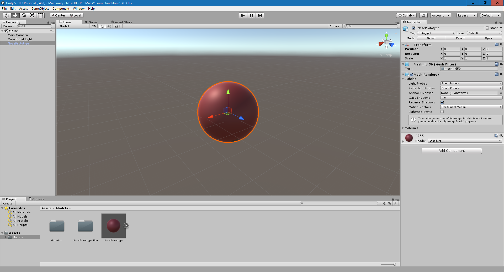

    Click the **Game** tab on top of the **Scene** view to see how the scene appears from the camera. In the end, we want to position the nose so that it is visible from the camera.

    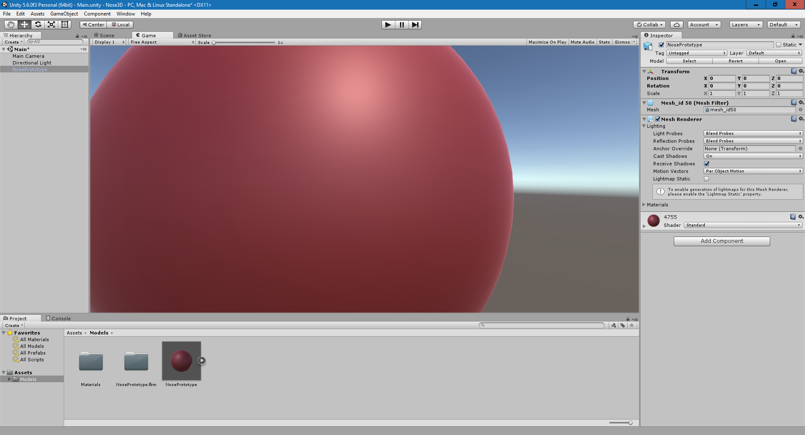

    There are some issues we need to address:

    * The scale is different between Unity and Paint 3D, so the nose object we imported is very big.
    * The origin for the polygons in the 3D model is not the center of the GameObject.
    * The color is a bit dark.

6. To solve the scale issue, in the **Hierarchy** view click on the **NosePrototype** object. Then click the **Inspector** tab to the right of the game view to see the **Position**, **Scale** and **Rotation** properties. Set the **Scale** to **0.01**

    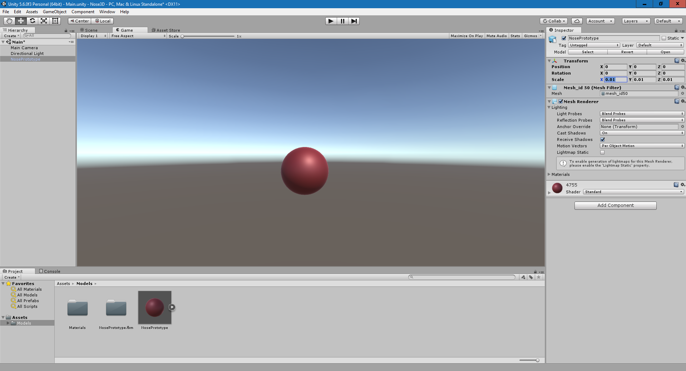

7. To solve the origin issue, add a new, empty GameObject to the scene by clicking the small **Create** button in the top-left of the **Hierarchy** panel. Then click **Create Empty**.

    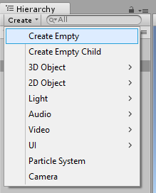

    A new **GameObject** item appears in the **Hierarchy** window. Click the **Scene** tab and then click on the  **GameObject** in the **Hierarchy** window. You can then view its properties in the **Inspector** window.

    Set the name to **Nose**, and then set the all the **Position** fields to **0** to center the empty **GameObject** in the scene. Hover your mouse over the **Scene** view and focus the GameObject by pressing **F**. You will then see the empty GameObject in the center of the scene, with the nose somewhere next to it.

    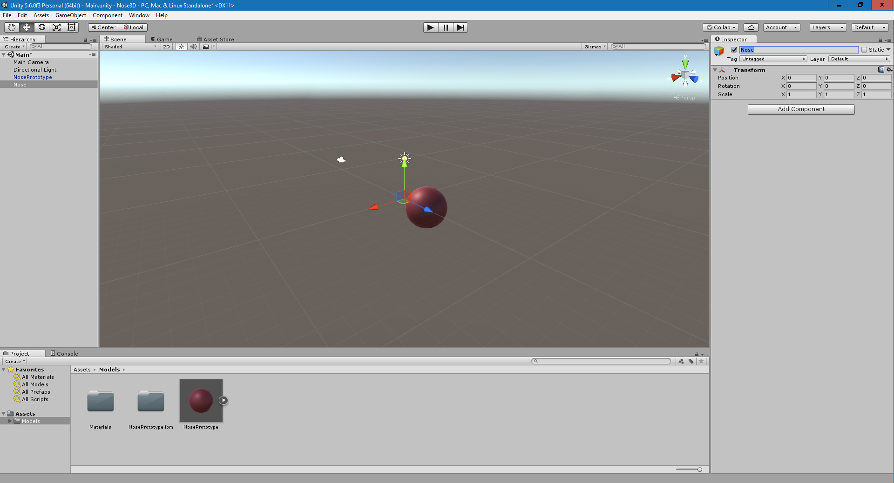

    In the **Hierarchy** windows, click **NosePrototype**. In the **Scene** view use the axis handles to position it as close to the center of the grid (thus overlapping the Nose object) as possible. Drag the red and green handles using the mouse to do so. It does not need to be 100% accurate; just get as close as you can.
    > Tip: The handles allow you to move the object along the selected axis. You can use the Grid and these handles to align them to the center. Look closely in the image below and note how the nose has been positioned so that the grid aligns with the axis handles:

    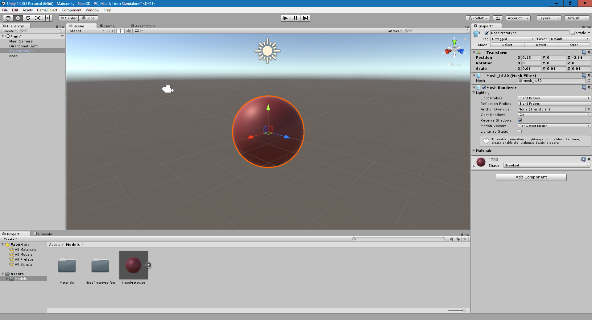

    With **NosePrototype** in the center, we need to use the **Hierarchy** view to make it a child of the new empty **Nose** GameObject. In the **Hierarchy** view, drag the **NosePrototype** GameObject and drop it on the **Nose** GameObject to make it a child.

    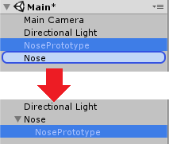

    Children are positioned relative to their parent. This means that if we rotate or move the parent GameObject, the child GameObject will follow.

8. Let's fix the dark color issue. Each GameObject that has a visible surface, such as our **NosePrototype** 3D model, gets a material property. A material describes how the surface to which the material is assigned to will look and behave. This includes color, texture assignment and light calculations. For those who are familiar with graphics programming, a material is the shader used to render the polygons.

    To find the assigned material that was generated when the model was imported, navigate to the **Materials** subfolder in the Assets folder, and click on **4755**.

    

    When we imported the object, Unity automatically generated a material, set the texture to what we made in Paint 3D, and assigned it to the model. The property that controls the texture is the **Albedo** property in the **Main Maps** section of the **Inspector** window.

    You can see the texture on the left of the property in a thumbnail. To the right of the property is a gray color. This is multiplied against the texture, which darkens it. Set this color to white to fix the darkness issue. Feel free to play around with the metallic and smoothness settings to give it a metallic or matte look based on your preference.

    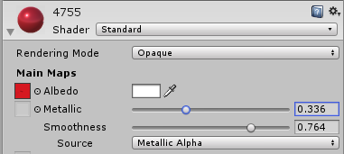

9. With the scale and color issues addressed, the color now looks more natural, the object has a better size and is centered.

    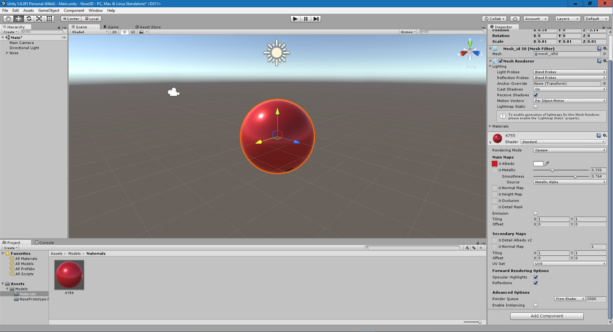

    Click the **Game** tab to verify what the user will see when they launch the app. From this view, you can continue to modify the scale and position if needed. In my case, it now looks like this:

    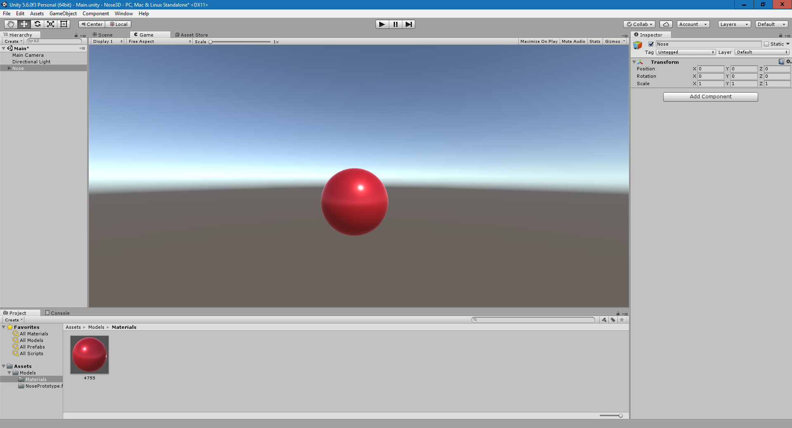

### Make the nose rotate

To make the nose rotate, we will create a custom component using C#.

1. In the **Assets** folder at the bottom of the screen, create a new folder named **Scripts**:

    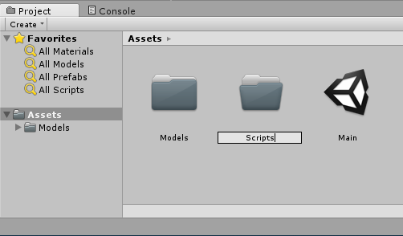

2. In the Scripts folder, right click and click **Create > C# script**. Name it **NoseRotator**

    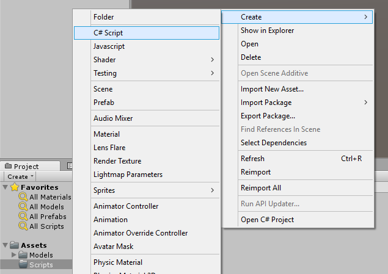

3. If the **Nose** GameObject in the **Hierarchy** view is not collapsed, collapse it now. Then drag and drop the **NoseRotator** script onto the **Nose** GameObject in the **Hierarchy** View, which adds it as a component to the **Nose** object:

    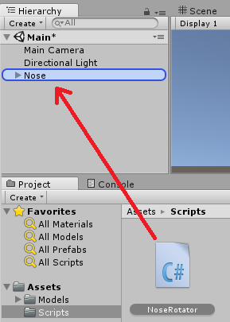

4. In the **Hierarchy** view, click on the **Nose** GameObject to see the component you added in the **Inspector**.

    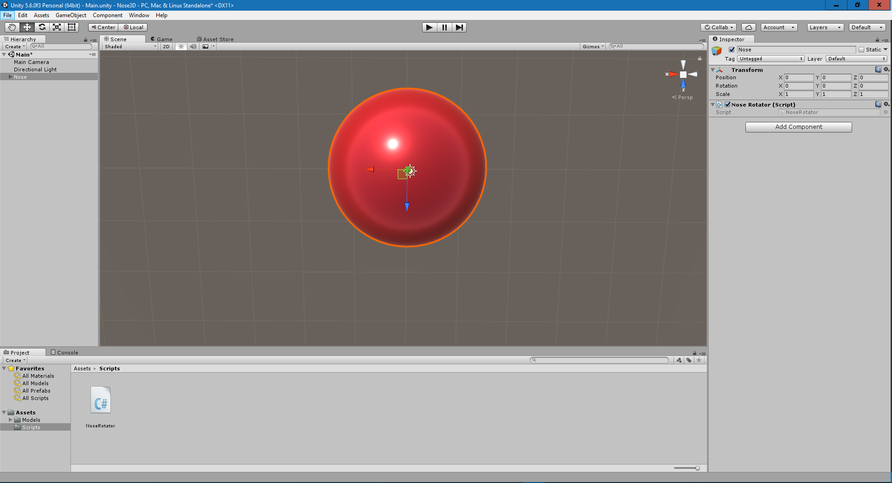

5. In the **Project** view, double-click the **NoseRotator** to edit the code. (Note: you can use the Unity Preferences (**Edit > Preferences**) to set which Editor you want to use. By default, Visual Studio opens.)

6. The script has two functions by default: `Start()` and `Update()`. `Start()` is called when the app launches. `Update()` is called every time a frame is rendered.
To animate the nose, we will rotate it slightly every time `Update()` is called. In `Update()`, add the following code:

        transform.Rotate(Time.deltaTime * Vector3.up * speed);

    Add a new public floating point variable called `speed` to the class, just above `Start()`. The code should now look like this:

        using System.Collections;
        using System.Collections.Generic;
        using UnityEngine;

        public class NoseRotator : MonoBehaviour {
            public float speed = 50.0f;

            // Use this for initialization
            void Start () {

            }

            // Update is called once per frame
            void Update () {
                transform.Rotate(Time.deltaTime * Vector3.up * speed);
            }
        }
        
    The `Rotate` function rotates the GameObject this script is attached to. `Time.deltaTime` is the amount of time since the last frame was rendered, so it can be used to sync the timing with the clock. `Vector3.up` is a Vector that describes the X, Y, and Z-axis and is set to: 0,1,0 which means the object will only rotate around the Y-axis. `speed` determines how fast it will rotate. Since we multiply `speed` against `Time.deltaTime`,  `speed` determines how many degrees it will rotate per second.

    Save the code and return to Unity.

7. **Test the app**: Before we export the project to a UWP app, we need to verify that the project is working. Click the **Play** button on top of the scene to automatically enter the **Game** tab and start running the code. You should now see the nose rotating in the center of the screen. It may be offset somewhat depending on how accurate you were when you centered it earlier.

    

    > Tip: With the Nose GameObject selected, you can see that the speed variable is visible in the **Inspector** window, and is set to 50. Because the speed variable is public, you can set its value directly in the **Inspector** window instead of changing the script.

### Export to a UWP app

The final step is to export our Nose 3D visualizer as a UWP app so that we can distribute it.

1. On the main menu, click **File > Build Settings**. The **Build Settings** dialog appears. A gray area is visible named **Scene in Build**. Click the button below it named **Add Open Scenes** to add the scene we have created to the list.

2. In the **Platform** list, select **Windows Store** and then click **Build**:

    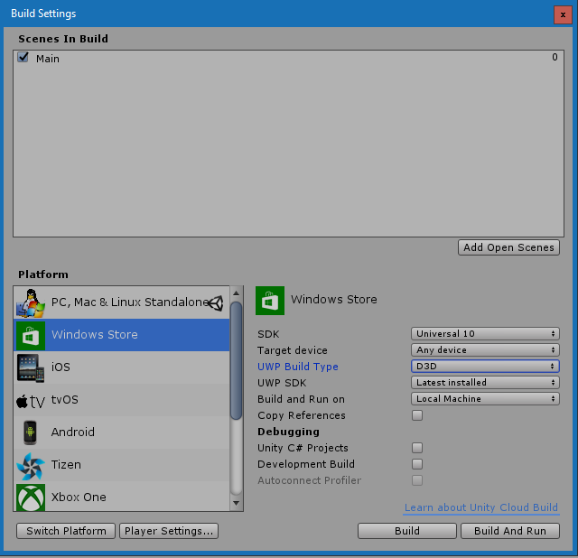

    When the **Build Windows Store** dialog appears, choose a location on your PC for the UWP app and click OK to begin exporting the project. This will take a minute.

3. When the build completes, the folder will open in File Explorer. Open **Nose3D.sln** in Visual Studio.

4. In Visual Studio, from the **Build Configuration** dropdown, change the Build Configuration to **Master** and the platform to **x64**.  Press **F5** to build, deploy, and run the project.

    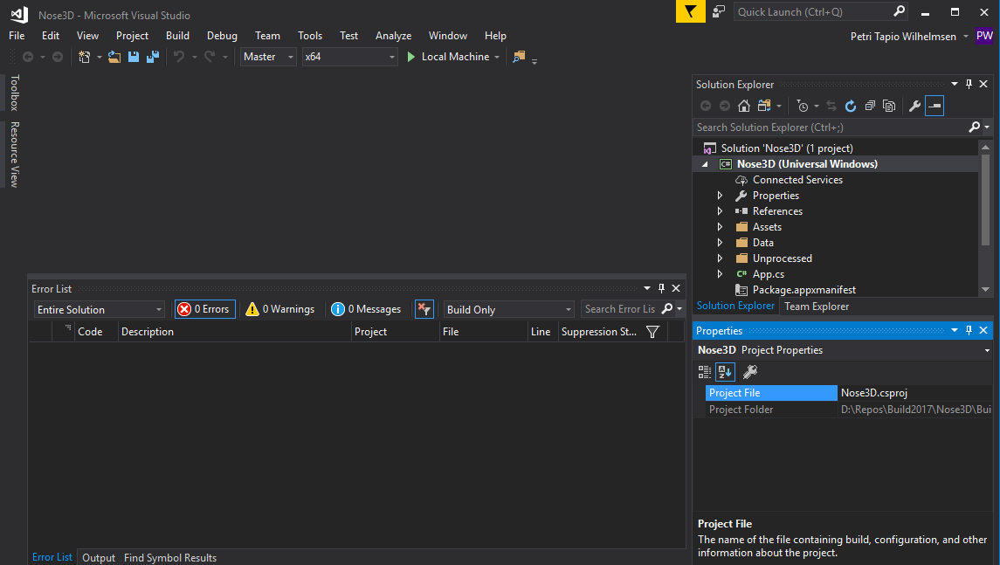   

5. The project will take a few minutes to build. When it completes, you should see the rotating 3D nose in the center of the app.

Congratulations, you have created a 3D Nose visualizer UWP app using Unity! Since this is a Windows Store app, you can access it from the Windows Start Menu.

## Continue to [next task >> ](512b_Babylon.md)
