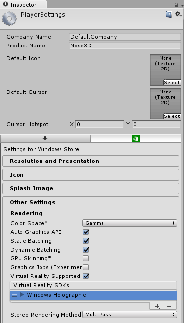

# Task 5.2.1 - Retarget UWP app to Mixed Reality Platform
The keynote is at a VR conference so we need a VR demo showing our Nose Prototypes. Having our 3D UWP app from 5.1.2a we can easily turn this into a VR-enabled app.

## Prerequisites 

This walkthrough assumes that you have:

* Windows 10 Creators Update
* 3D Nose Model from Paint 5.1.1 and 3D UWP from 5.1.2a
* Unity 5.6 with UWP Plugin for exporting UWP

## Task 

#### Using Unity 3D to enable Mixed Reality
Supporting Mixed Reality in Unity is just a simple toggle on the Build Settings in Unity.

1. Open the Nose3D project you created in Unity.
2. Go to **File | Build Settings** and click **Player Settings**
3. A new Player Settings property pane appears on the right side of the Unity3D window.
4. Click **Other Settings** to reveal a new set of properties.
5. Select **Virtual Reality Supported**. Windows Holographic should appear automatically.

    

6. Export the project again, replacing the folder you exported to in 5.1.2a.
7. Open the Nose3D.sln solution and build/deploy/run the app. It will now automatically detect that VR is enabled and will run in the connected VR headset.

> Note: Connecting a new VR headset requires the latest Windows 10 build. Windows will automatically detect the headset and launch the Mixed Reality portal. Follow the configuration steps here to set it up correctly.

## References
