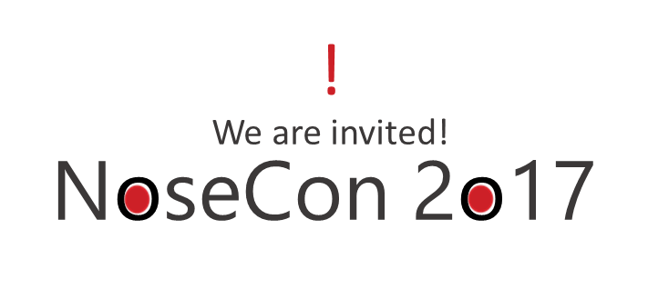

A great opportunity has developed! We are invited to speak in the keynote of NoseCon 2017! The topic is how 3D and VR is helping us with rapid prototyping. We need to create a keynote demo for NoseCon that renders a Nose Prototype in 3D, or even in VR if we find the time. This is highly confidential. 

   * **Deliverable** - Build a UWP 3D Visualizer
      * [5.1.1 - [Required] Create the model in Paint3D][511]
      * [5.1.2a - [Required] Create a Unity solution to visualize 3D Model (d 5.1.1)][512a] or
      * [5.1.2b - [Required] Create a BabylonJS solution to visualize 3D Model (d 5.1.1)][512b]
   * **Deliverable** - Visualize noses in VR
      * [5.2.1 - [Required] Re-target UWP app to Mixed Reality Platform (d 5.1.2)][521]

[511]: 511_Paint3d.md
[512a]: 512a_Unity.md
[512b]: 512b_Babylon.md
[521]: 521_MR.md
